# AI Consulting Report Generator

**Build 5 - BrightPath ChatGPT Mastery Project**

Turn synthetic AI readiness audit findings into a structured client-facing consulting report, risk register, opportunity portfolio, 30/60/90-day roadmap, PDF report, PowerPoint executive deck, and completion review.

---

## Overview

The AI Consulting Report Generator is a portfolio-ready Streamlit prototype for producing responsible AI consulting deliverables from a synthetic audit scenario. It uses the BrightPath Skills Training demo dataset to show how audit findings can become a polished report pack without using real client data or external AI APIs.

The app is deterministic and template-based throughout. It does not call OpenAI, Claude, LangChain, LlamaIndex, vector databases, or any external LLM service.

---

## Problem Statement

After an AI readiness audit, consultants often spend significant time turning raw findings into clear client deliverables. This build demonstrates a structured workflow that converts audit findings into readiness interpretation, risks, opportunities, roadmap actions, report sections, and exports.

---

## Target Users

- AI consultants preparing post-audit client deliverables
- AI governance and risk leads reviewing adoption plans
- L&D teams planning responsible AI training and pilot activity
- Portfolio reviewers assessing the ChatGPT Mastery build sequence

---

## Consulting Workflow

```text
Audit Data
-> Readiness Summary
-> Risk Register
-> Opportunity and Pilot Recommendations
-> Roadmap
-> Report Sections
-> Client Report
-> Export Centre
-> Completion Review
```

---

## Build 5 Phase Summary

| Phase | Feature | Status |
|---|---|---|
| Phase 1 | Scaffold and sample audit data setup | Complete |
| Phase 2 | Readiness summary and score interpretation | Complete |
| Phase 3 | Risk register generator | Complete |
| Phase 4 | Opportunity and pilot recommendation generator | Complete |
| Phase 5 | 30/60/90-day roadmap generator | Complete |
| Phase 6 | Report section generator | Complete |
| Phase 7 | Client report builder | Complete |
| Phase 8 | Export Centre with PDF/PPTX/charts | Complete |
| Phase 9 | Completion review and portfolio notes | Complete |

---

## Features

- Synthetic BrightPath audit data loader
- Six-dimension AI readiness score interpretation
- Strengths, gaps, strategic interpretation, and recommendations
- AI risk register with likelihood, impact, controls, owners, and priority actions
- AI opportunity portfolio and recommended pilot sequence
- 30/60/90-day implementation roadmap
- Eleven deterministic client-facing report sections
- Full Markdown client report builder with section selection
- Analytics charts for completion, readiness, risks, opportunities, and roadmap actions
- Completion Review page for final portfolio/demo readiness checks
- Portfolio notes and BrightPath case-study notes

---

## Export Formats

- Markdown client report
- PDF consulting report generated with reportlab
- PowerPoint executive deck generated with python-pptx
- Markdown completion review
- Markdown portfolio notes

---

## Responsible-Use Boundaries

- Use synthetic/demo organisation data only
- Do not use real client records
- Do not use learner data
- Do not use safeguarding case information
- Do not use staff HR data
- Do not use personal data
- Do not use confidential data
- Do not use regulated information
- Do not present outputs as legal, safeguarding, HR, compliance, financial, medical, or professional advice
- Human review is required before any real-world use
- Responsible owners and governance approval are required before any production use
- This prototype is not production deployed

---

## Technical Stack

| Component | Technology |
|---|---|
| App framework | Streamlit |
| Language | Python |
| State management | `st.session_state` |
| Data model | Python dict/list structures |
| Charts | matplotlib with Agg backend |
| PDF export | reportlab |
| PowerPoint export | python-pptx |
| Tests | pytest |
| External AI/LLM | None |

---

## How To Run

```bash
cd 10-builds/ai-consulting-report-generator
source .venv/bin/activate
streamlit run app.py
```

The app opens at `http://localhost:8501`.

---

## How To Test

```bash
cd 10-builds/ai-consulting-report-generator
source .venv/bin/activate
pytest
```

---

## Demo Workflow

1. Open the app.
2. Load BrightPath demo audit data.
3. Generate the Readiness Summary.
4. Generate the Risk Register.
5. Generate the Opportunity Portfolio.
6. Generate the 30/60/90-day Roadmap.
7. Generate Report Sections.
8. Generate the Client Report.
9. Open Export Centre and generate/download Markdown, PDF, and PowerPoint outputs.
10. Open Completion Review and show phase completion, output completion, documentation status, responsible-use position, and downloadable portfolio notes.

---

## Screenshots

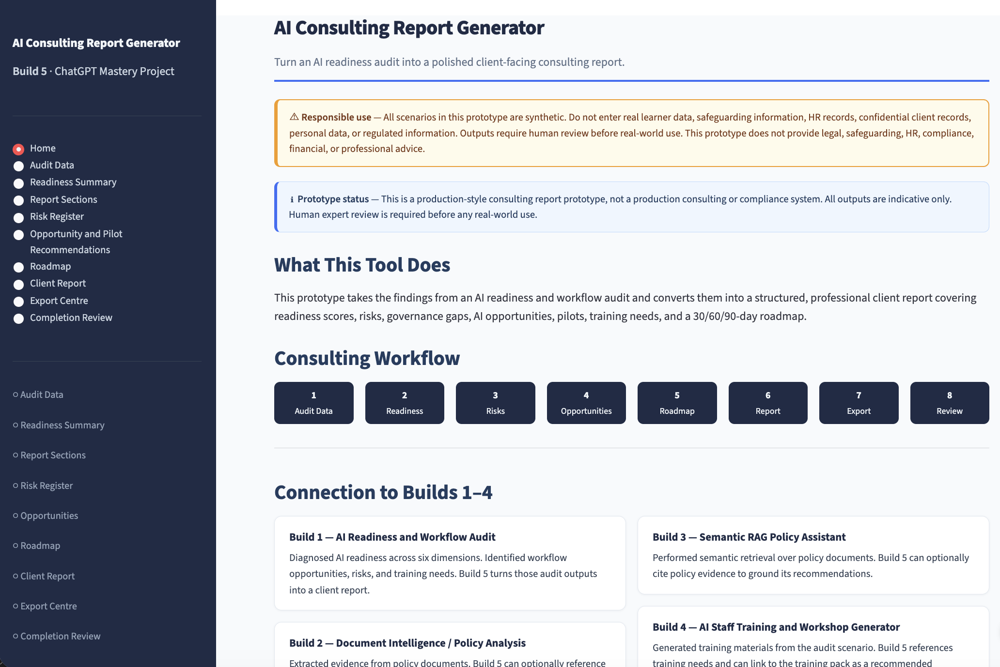

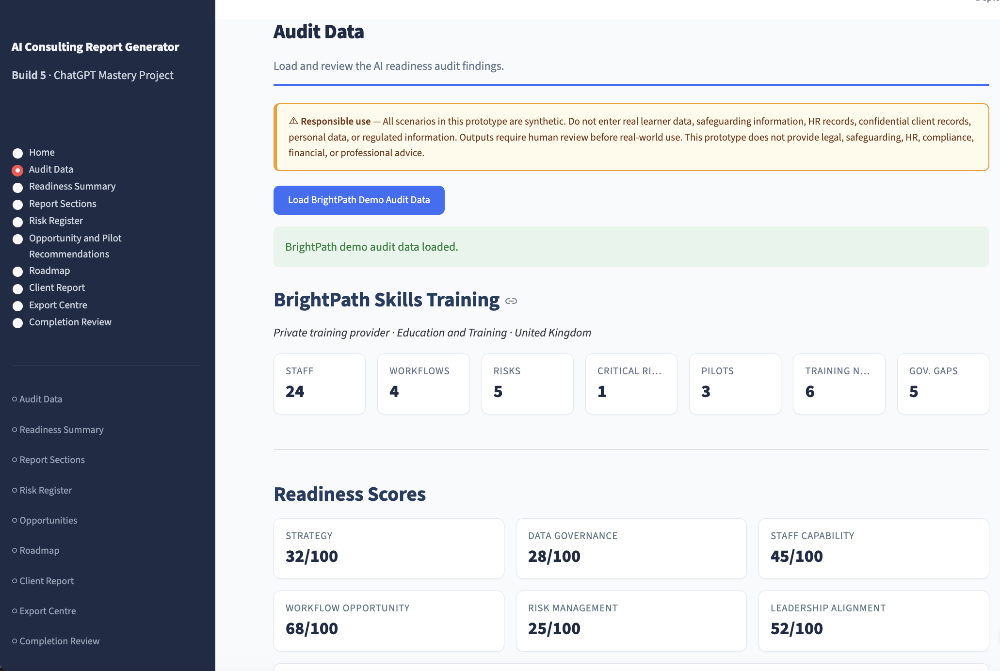

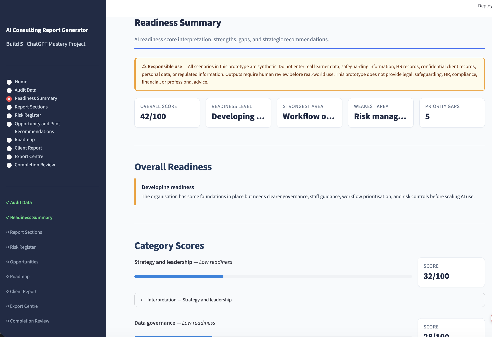

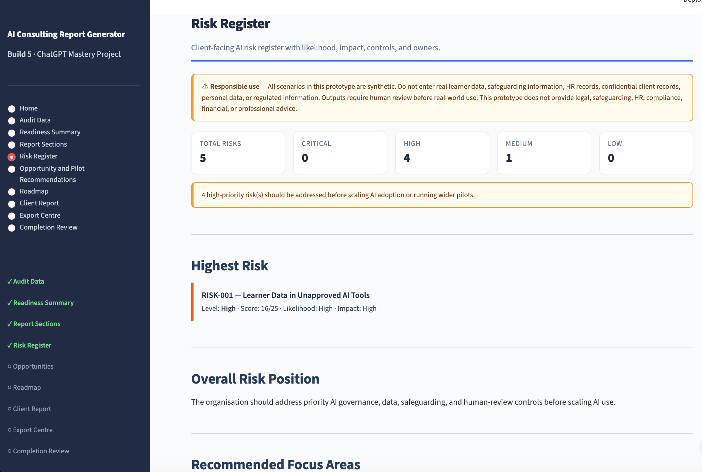

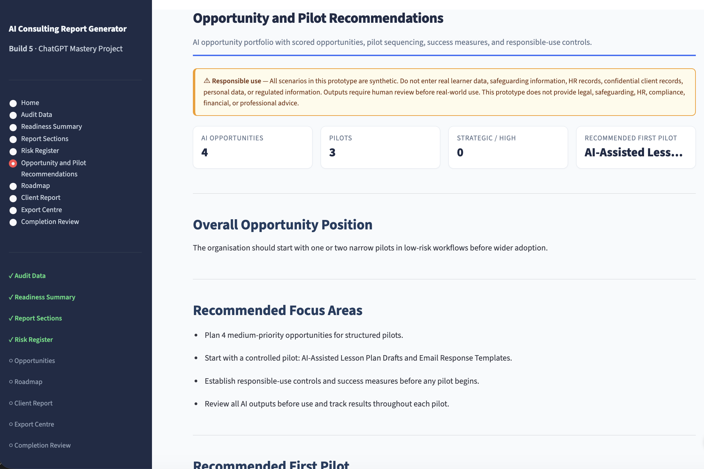

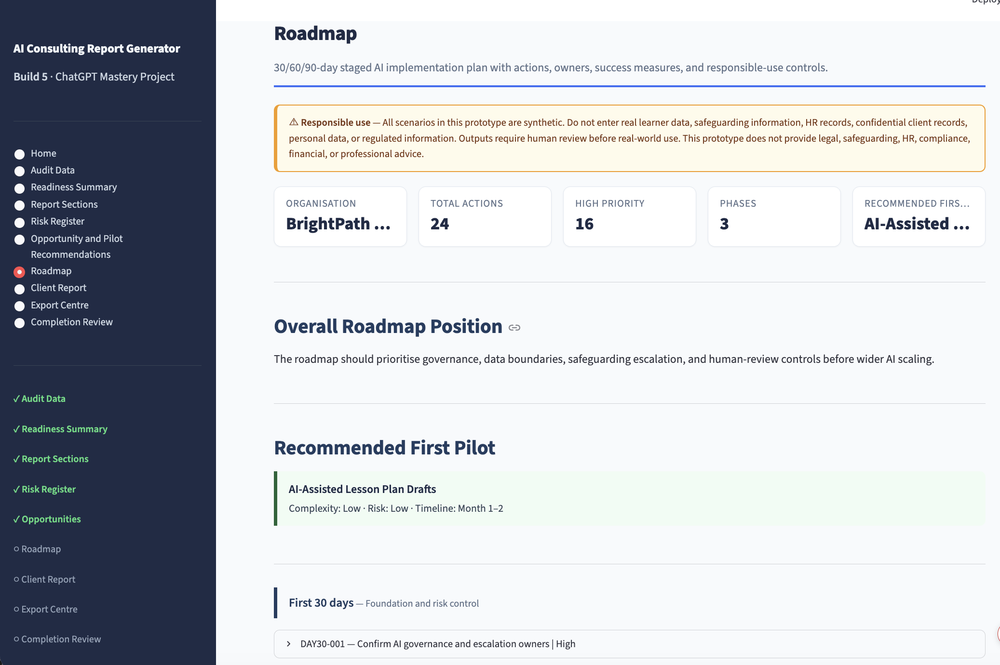

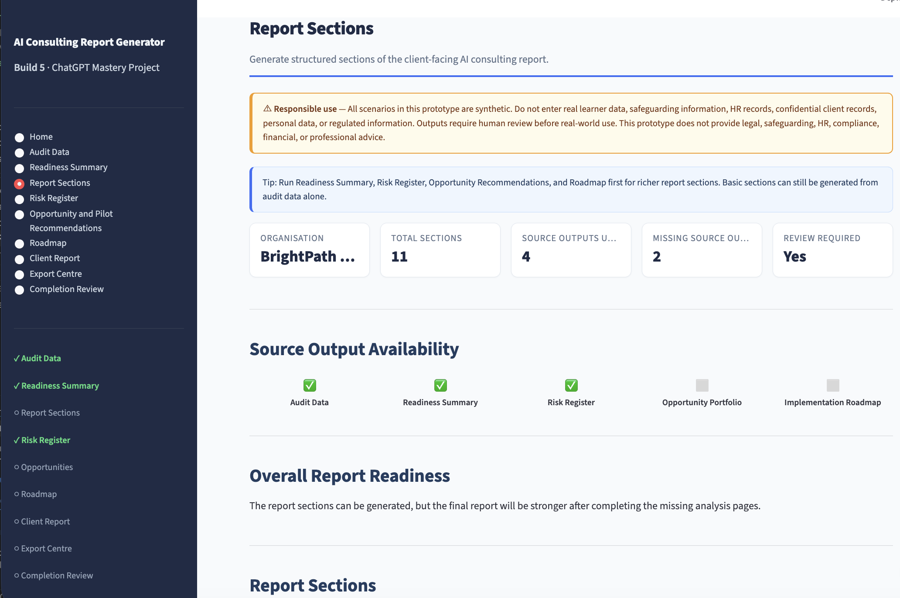

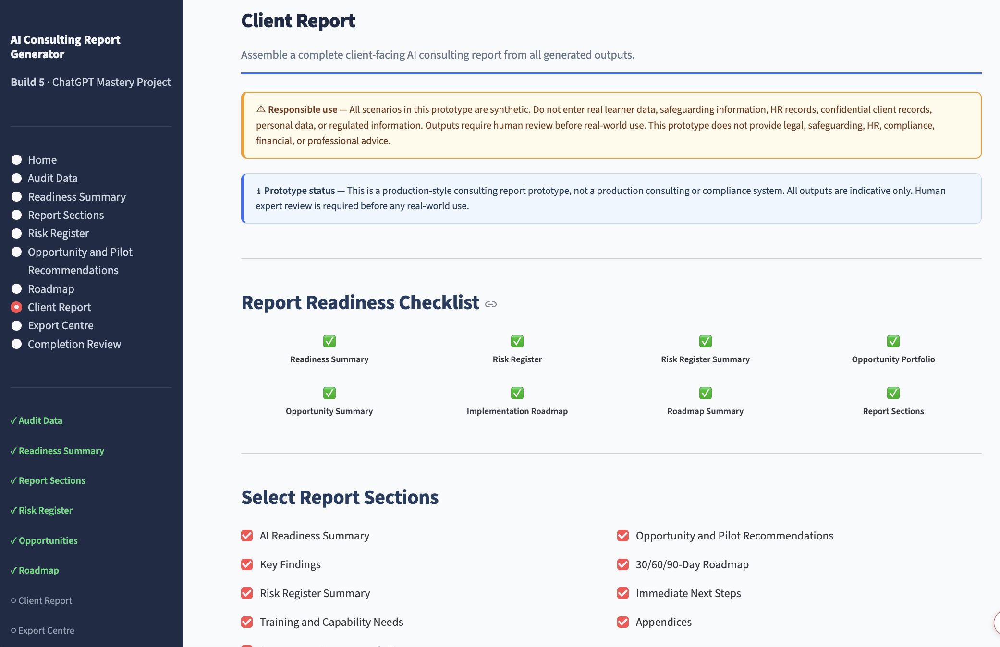

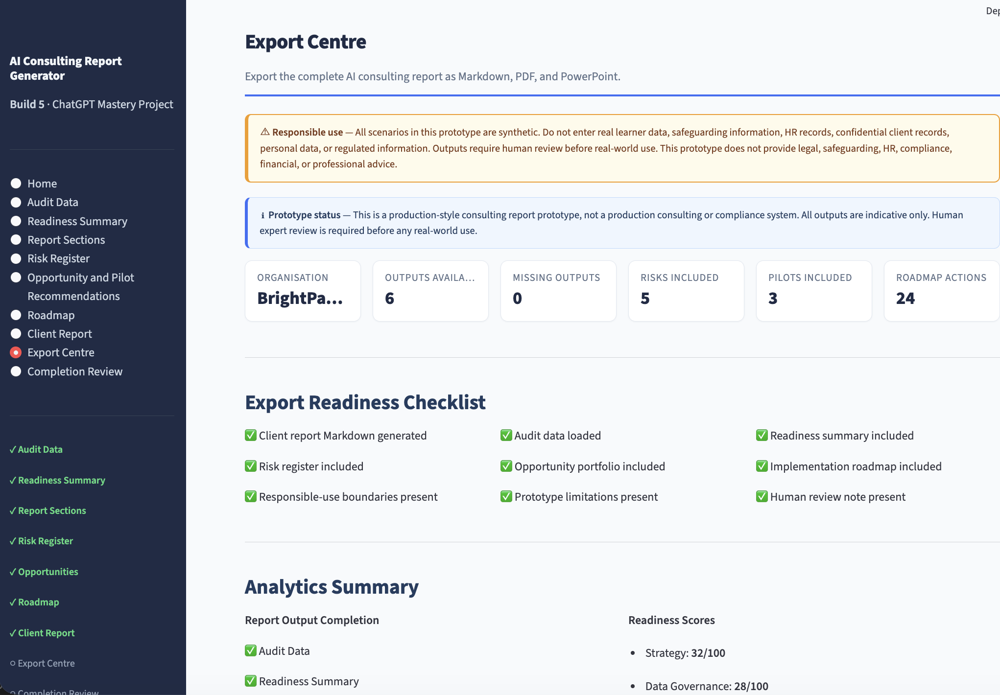

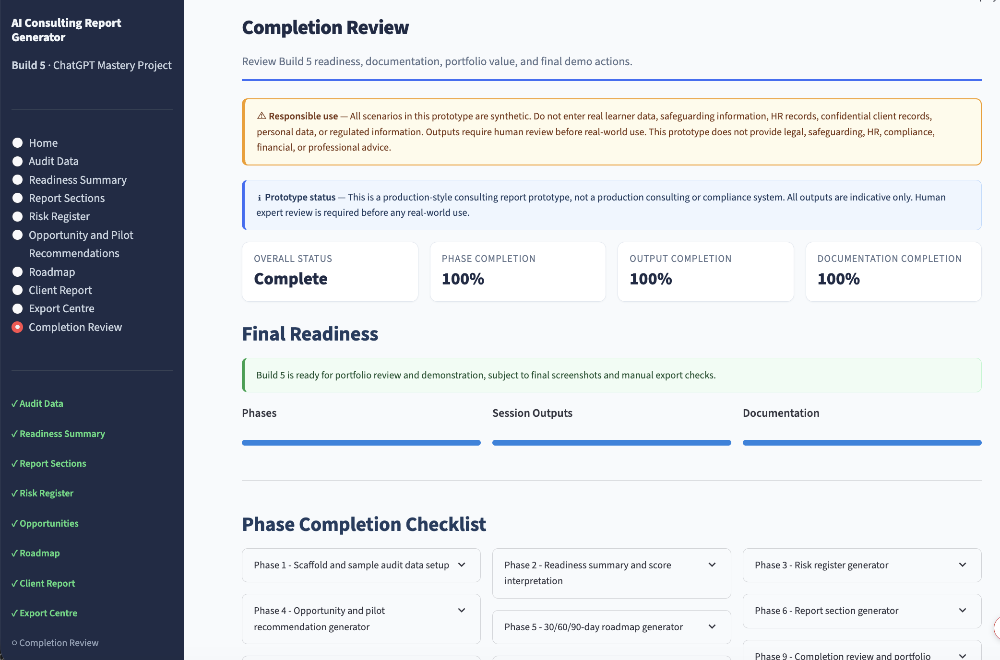

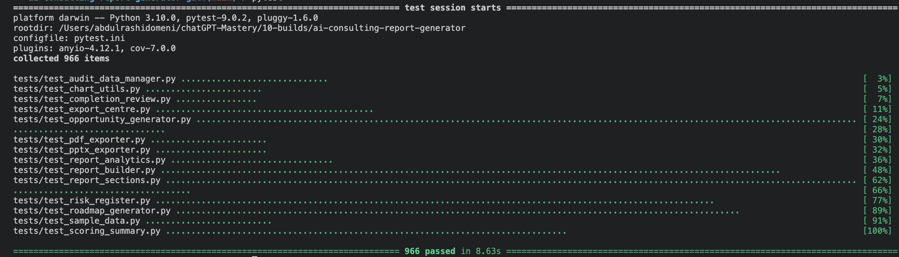

See `docs/screenshots-checklist.md` for the full recommended screenshot set including PDF and PowerPoint previews (not yet captured).

---

## Relationship To Builds 1-4

| Build | Relationship |
|---|---|
| Build 1 - AI Readiness and Workflow Audit | Source concept for readiness scores, workflow findings, risks, and training needs |
| Build 2 - Document Intelligence / Policy Analysis | Future source for structured policy evidence and governance context |
| Build 3 - Semantic RAG Policy Assistant | Future source for grounded evidence retrieval and policy citations |
| Build 4 - AI Staff Training and Workshop Generator | Companion deliverable for training needs identified by Build 5 |

Build 5 closes the consulting loop by turning readiness and workflow findings into practical client deliverables.

---

## Limitations

- Synthetic/demo data only
- No real client, learner, HR, safeguarding, personal, confidential, or regulated data
- No external LLM or AI API calls
- No document upload
- No authentication
- No persistent storage
- No cloud deployment
- No production-readiness claim
- Outputs require qualified human review before any real-world use

---

## Future Improvements

See `docs/future-improvements.md`.

Potential future directions include branded PDF themes, editable Word export, richer PowerPoint templates, secure client portal, authentication, audit logging, real-data import with governance controls, and optional local LLM-assisted drafting with strict evidence controls.

---

## Portfolio Positioning

This build demonstrates end-to-end AI consulting product thinking: structured audit inputs, deterministic analysis, report generation, export automation, responsible-use boundaries, testing, and final portfolio review. It is a strong capstone for the ChatGPT Mastery consulting workflow because it shows how AI-readiness diagnosis becomes client-facing deliverables.

---

*Build 5 - AI Consulting Report Generator - BrightPath ChatGPT Mastery Project*
*Synthetic scenarios only. Human review required before any real-world use.*
