# AI Governance Policy Checker

**Build 6 - BrightPath ChatGPT Mastery Project**

A portfolio-ready Streamlit prototype that reviews synthetic AI policy text against a responsible AI governance framework, identifies coverage gaps, generates policy improvement recommendations, calculates governance maturity, and exports a governance review report.

---

## Overview

The AI Governance Policy Checker is a portfolio-ready Streamlit prototype for reviewing whether a synthetic organisation's AI policies cover the key areas of responsible AI governance. It uses the BrightPath Skills Training synthetic policy pack and a structured 12-domain governance framework to demonstrate a policy coverage review workflow without using real client data or external AI APIs.

The app is deterministic and template-based throughout. It does not call OpenAI, Claude, LangChain, LlamaIndex, vector databases, or any external LLM service.

Build 6 is complete across all 8 phases.

---

## Problem Statement

After an AI readiness audit, an AI consultant often needs to review whether the organisation's existing policies adequately address responsible AI governance. This build demonstrates a structured workflow that converts a synthetic policy pack into a governance coverage review, gap identification, improvement recommendations, maturity scoring, and a client-facing governance review report.

---

## Target Users

- AI consultants reviewing client governance readiness
- AI governance and risk leads assessing policy coverage
- Training providers and educational organisations with AI usage policies
- L&D teams building AI governance training programmes
- Compliance teams assessing AI policy coverage
- Portfolio reviewers assessing the ChatGPT Mastery build sequence

---

## Governance Review Workflow

```text
Synthetic Policies
-> Governance Framework
-> Policy Coverage Review
-> Gap Analysis
-> Recommendations
-> Maturity Summary
-> Governance Report
-> Export
-> Completion Review
```

---

## Build 6 Phase Summary

| Phase | Feature | Status |
|---|---|---|
| Phase 1 | Scaffold and synthetic policy data setup | Complete |
| Phase 2 | Governance framework coverage checker | Complete |
| Phase 3 | Policy gap analysis | Complete |
| Phase 4 | Policy improvement recommendation engine | Complete |
| Phase 5 | Governance score and maturity summary | Complete |
| Phase 6 | Governance report builder | Complete |
| Phase 7 | Export Centre with PDF/charts | Complete |
| Phase 8 | Completion review and portfolio notes | Complete |

---

## App Pages

| Page | Status | Purpose |
|---|---|---|
| Home | Functional | Project overview, workflow, connections to Builds 1–5 |
| Policy Library | Functional | Load and review synthetic policy pack |
| Governance Framework | Functional | Load and explore 12 governance domains |
| Policy Checker | Functional | Compare policy text against governance domains (Phase 2) |
| Gap Analysis | Functional | Identify missing and weak governance coverage (Phase 3) |
| Recommendations | Functional | Generate policy improvement recommendations (Phase 4) |
| Governance Maturity | Functional | Governance maturity score, domain scores, blockers, and adoption readiness (Phase 5) |
| Governance Report | Functional | Client-facing AI governance policy review report (Phase 6) |
| Export Centre | Functional | Export Markdown and PDF reports with analytics and charts (Phase 7) |
| Completion Review | Functional | Build completion status, portfolio value, and portfolio notes (Phase 8) |

---

## Features

- Synthetic BrightPath Skills Training policy pack (6 policies, 12 risk areas)
- 12-domain responsible AI governance framework
- Keyword-based coverage checker (deterministic, no LLM)
- Policy gap analysis with severity classification (Critical / High / Medium / Low)
- Policy improvement recommendations with wording directions, implementation steps, review questions, and success criteria
- Governance maturity scoring with domain-level breakdown and maturity blocker identification
- Markdown governance report builder assembling all outputs into a client-facing document
- PDF export with cover page, analytics tables, and embedded chart images
- Matplotlib chart analytics (6 chart types)
- Completion review with phase, output, and documentation status tracking
- Portfolio notes and case study Markdown download

---

## Export Formats

| Format | Contents |
|---|---|
| Markdown report | Full governance review report |
| PDF report | Cover page, analytics tables, chart images, report content, responsible-use section |
| Coverage review Markdown | Domain-level coverage results and evidence |
| Gap analysis Markdown | Prioritised gap analysis with risk statements |
| Recommendations Markdown | Prioritised recommendations with wording directions |
| Maturity Markdown | Governance maturity scores and domain breakdown |
| Completion review Markdown | Phase completion, output status, portfolio value |
| Portfolio notes Markdown | One-line summary, case study, LinkedIn/GitHub description |

---

## Synthetic Policy Pack

BrightPath Skills Training — synthetic demo organisation (UK training provider).

| Policy | Type | Owner |
|---|---|---|
| AI Acceptable Use Policy | Acceptable Use | Chief Executive Officer |
| Data Protection and AI Use Guidance | Data Protection | Data Protection Lead |
| Safeguarding and AI Boundary Policy | Safeguarding | Designated Safeguarding Lead |
| Staff AI Tool Use Procedure | Procedure | Head of Operations |
| AI Output Review Checklist | Checklist | Quality and Standards Lead |
| AI Incident and Escalation Procedure | Incident Procedure | Head of Operations |

---

## Responsible AI Governance Framework

12 governance domains assessed in the policy review:

| Domain | Priority |
|---|---|
| Strategy and Ownership | High |
| Approved AI Tools | High |
| Prohibited AI Uses | Medium |
| Data Protection and Confidentiality | High |
| Learner and Client Data Boundaries | High |
| Safeguarding Boundaries | High |
| Human Review and Accountability | High |
| Accuracy and Hallucination Control | Medium |
| Bias, Fairness, and Inclusion | Medium |
| Staff Training and Capability | Medium |
| Escalation and Incident Reporting | High |
| Monitoring, Review, and Continuous Improvement | Medium |

---

## Responsible-Use Boundaries

- Synthetic/demo organisation data only
- Do not use real client policies, learner data, safeguarding case information
- Do not use staff HR data, personal data, confidential data, or regulated information
- Not legal, safeguarding, HR, compliance, financial, medical, or professional advice
- Not a compliance certification system
- Human review required before any real-world use

See `docs/safety-boundaries.md` for full details.

---

## Technical Stack

| Component | Technology |
|---|---|
| App framework | Streamlit |
| Language | Python 3 |
| State management | `st.session_state` |
| Data model | Python dict/list structures |
| PDF export | reportlab |
| Charts | matplotlib |
| Tests | pytest |
| External AI/LLM | None |

---

## How To Run

```bash
cd 10-builds/ai-governance-policy-checker
python -m venv .venv
source .venv/bin/activate
pip install -r requirements.txt
streamlit run app.py
```

The app opens at `http://localhost:8501`.

---

## How To Test

```bash
cd 10-builds/ai-governance-policy-checker
source .venv/bin/activate
pytest
```

Target: 783+ tests passing.

---

## Demo Workflow

1. Open the app — read the Home page.
2. **Policy Library** — load the BrightPath synthetic policy pack.
3. **Governance Framework** — load the responsible AI governance framework.
4. **Policy Checker** — run the policy coverage check.
5. **Gap Analysis** — review gaps auto-generated from coverage.
6. **Recommendations** — review recommendations auto-generated from gaps.
7. **Governance Maturity** — review maturity summary auto-generated from all outputs.
8. **Governance Report** — generate the full Markdown governance report.
9. **Export Centre** — generate analytics, charts, and download Markdown and PDF reports.
10. **Completion Review** — confirm build completion status and download portfolio notes.

See `docs/demo-script.md` for a detailed walkthrough.

---

## Screenshots

### Home Page
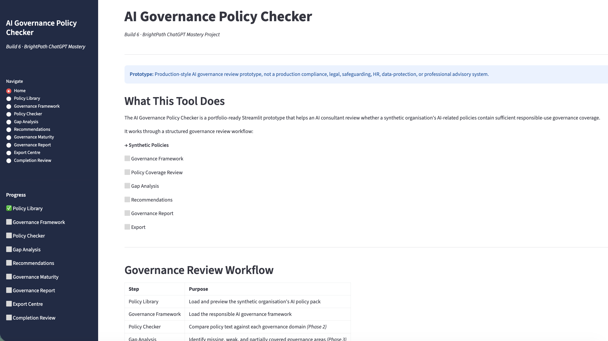

### Policy Library
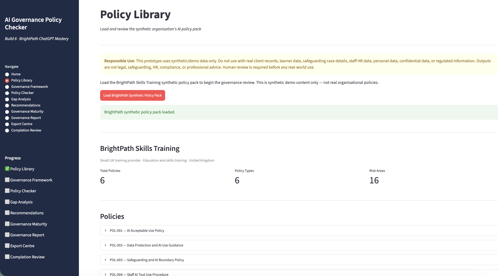

### Policy Pack Loaded
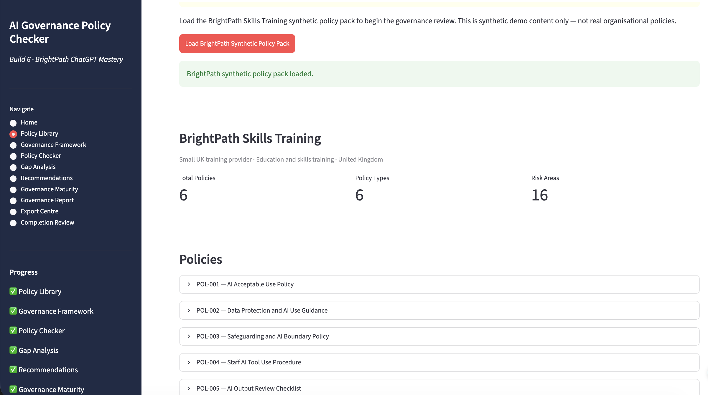

### Governance Framework
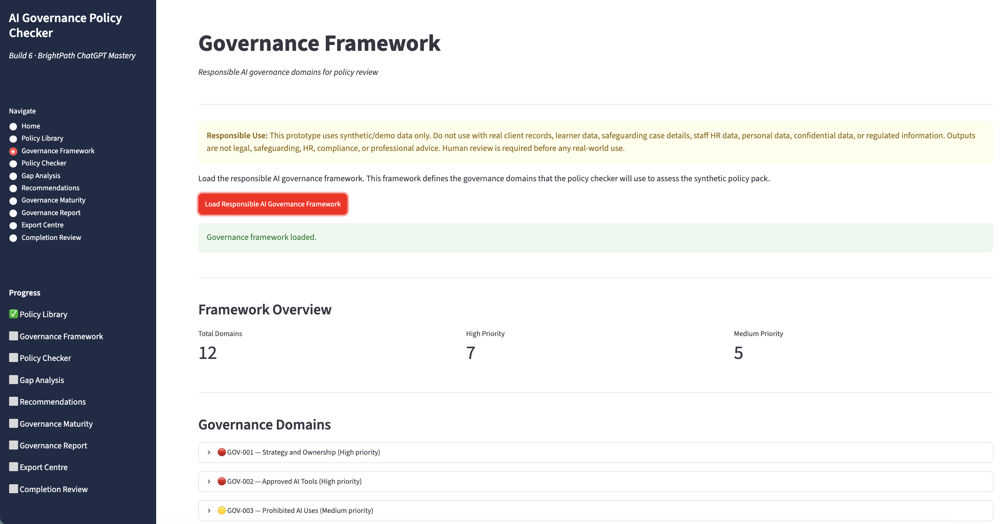

### Policy Checker
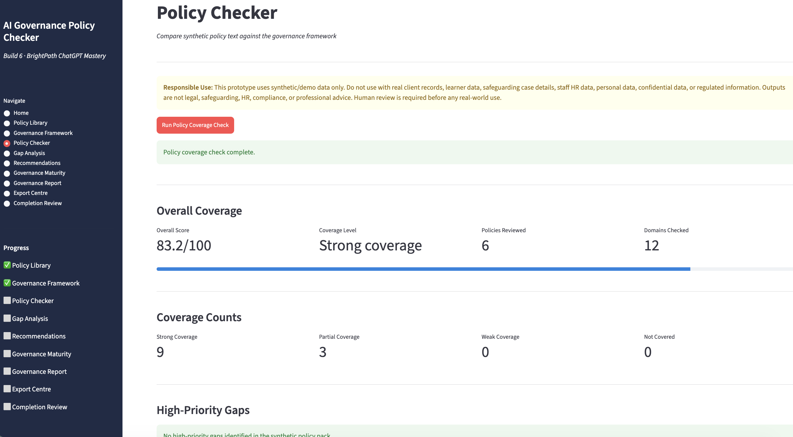

### Gap Analysis
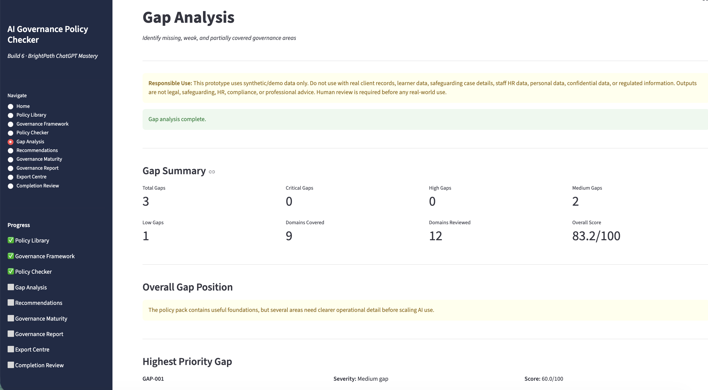

### Recommendations
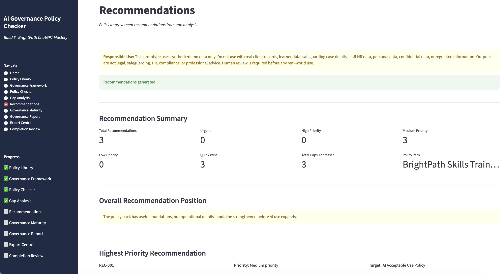

### Governance Maturity
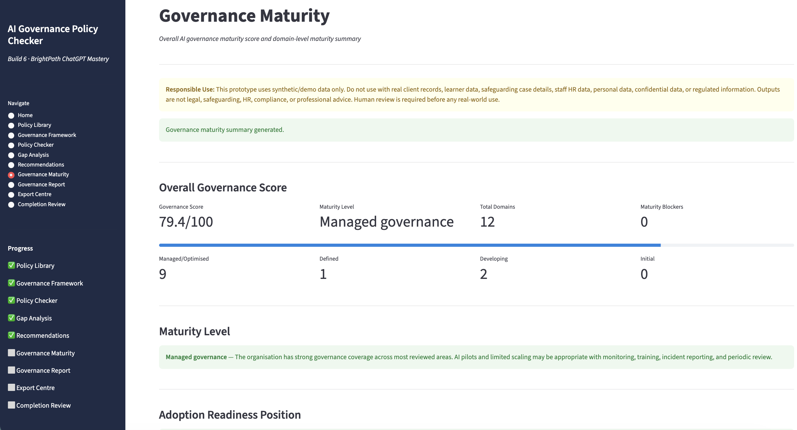

### Governance Report
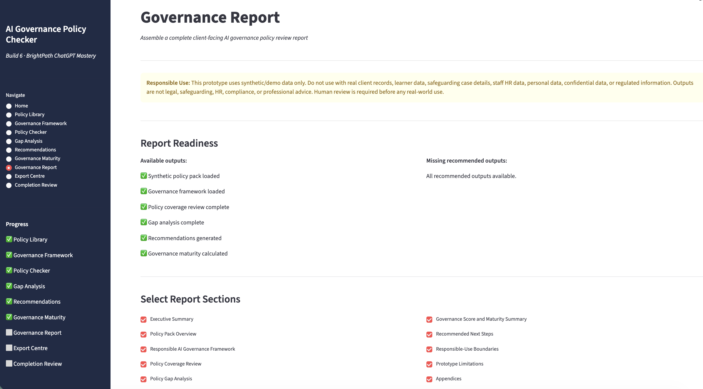

### Export Centre
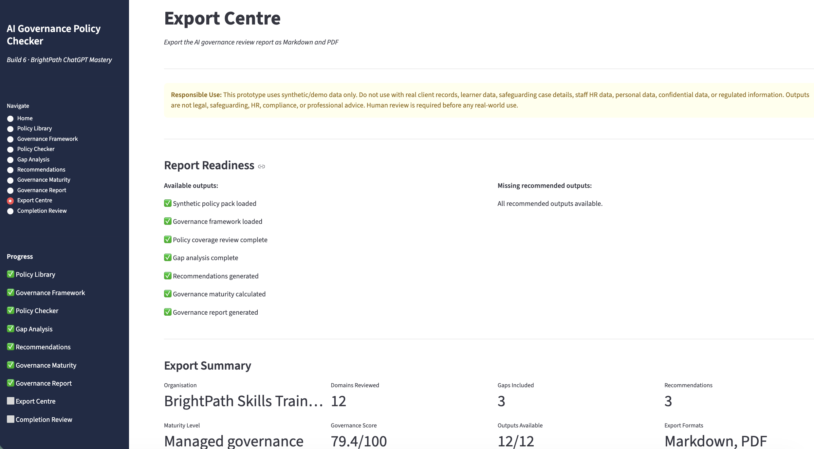

### Export Centre (detail)
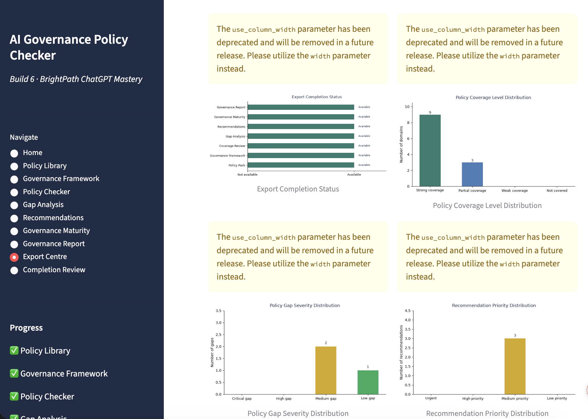

### PDF Report Preview
[View PDF report sample](assets/screenshots/11-pdf-report-preview.png.pdf)

### Completion Review
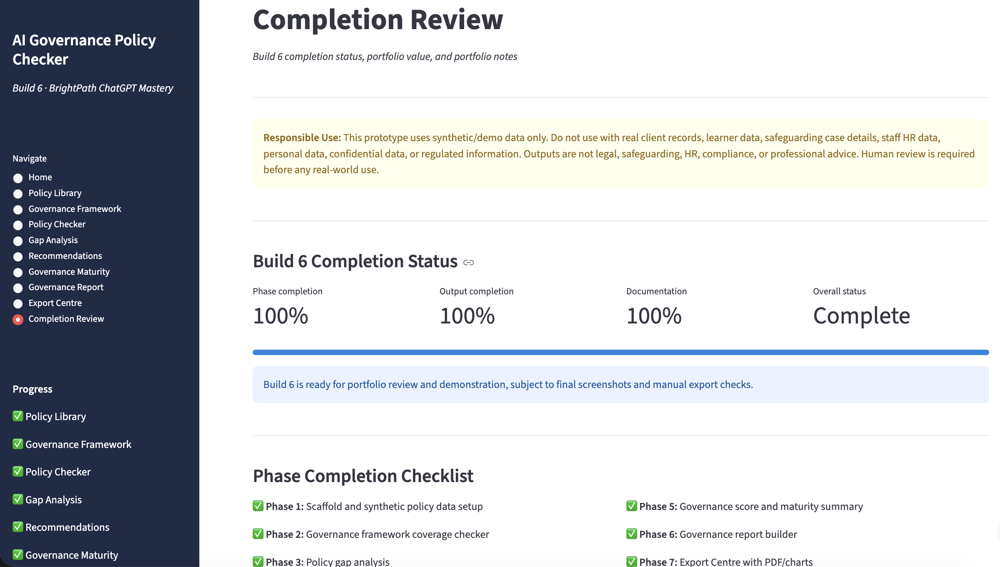

### Test Results
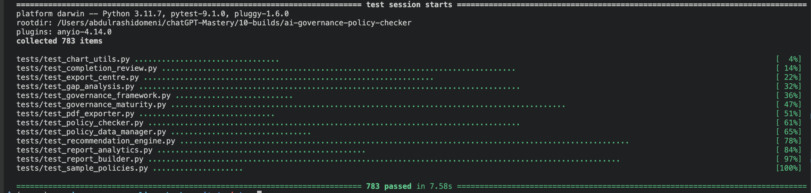

---

## Relationship to Builds 1–5

| Build | Relationship |
|---|---|
| Build 1 - AI Readiness and Workflow Audit | Readiness findings highlight governance gaps that Build 6 checks |
| Build 2 - Document Intelligence / Policy Analysis | Future source for structured policy evidence |
| Build 3 - Semantic RAG Policy Assistant | Future source for grounded evidence retrieval from policy documents |
| Build 4 - AI Staff Training and Workshop Generator | Training needs identified by Build 6 can feed into Build 4 |
| Build 5 - AI Consulting Report Generator | Governance review outputs can be embedded in a consulting report |

Build 6 closes the governance loop by turning policy pack review into structured governance findings, gap identification, improvement recommendations, maturity scoring, and a client-ready report.

---

## Limitations

- Synthetic/demo data only
- No real client policies, learner data, HR data, safeguarding data, personal data, confidential data, or regulated information
- No external LLM or AI API calls
- No document upload
- No authentication
- No persistent storage
- No cloud deployment
- No production-readiness claim
- Policy coverage checker, gap analysis, and recommendations require human review before any real-world use

---

## Future Improvements

See `docs/future-improvements.md`.

Potential future directions include advanced branded PDF templates, editable Word export, PowerPoint executive deck export, optional LLM-assisted analysis with strict evidence controls, secure real-policy upload with full governance controls, and integration with Builds 1, 3, and 5.

---

## Portfolio Positioning

This build demonstrates AI governance consulting product thinking: structured policy input, responsible governance framework application, coverage review workflow design, gap analysis and prioritisation, recommendation generation, maturity scoring, report export, and responsible-use boundaries — all without external LLM dependency and with 783+ automated tests.

See `docs/portfolio-notes.md` for a full portfolio description, case study summary, and suggested LinkedIn/GitHub description.

---

*Build 6 - AI Governance Policy Checker - BrightPath ChatGPT Mastery Project*
*Synthetic scenarios only. Human review required before any real-world use.*
