# Build 9 — AI Adoption Consulting Capstone Dashboard

> The capstone build that connects Builds 1–8 into one end-to-end AI adoption consulting journey — from initial diagnosis to governed implementation to a downloadable client deliverable.


---

## What This Build Does

Build 9 is an 8-page Streamlit dashboard that aggregates synthetic evidence from all previous builds into one structured client view. It produces a consulting report, a recommendation pathway, and a downloadable evidence pack in five formats — the actual deliverables of a real AI adoption consulting engagement.

Everything is built with deterministic Python logic and synthetic data. No external AI APIs, no real client data, no database, no authentication.

---

## Why It Exists

Most AI consulting portfolios show individual tools in isolation. They rarely demonstrate how those tools connect into one coherent story — how a consultant actually moves a client organisation from initial diagnosis to governed AI implementation.

Build 9 answers that question directly. It shows:

- How evidence from eight different consulting tools becomes one picture of a client's AI adoption position
- How that picture translates into a structured consulting recommendation and a commercial next step
- How the result is packaged as a report, dashboard, and evidence pack — the deliverables a real client would receive

---

## How It Connects Builds 1–8

| Build | Tool | What Build 9 Uses |
|---|---|---|
| 1 | AI Readiness + Workflow Audit | Readiness findings and workflow priority scores |
| 2 / 3 | Document Intelligence / Semantic RAG | Document handling capability and retrieval evidence |
| 4 | AI Staff Training Workshop Generator | Training delivery, workshop design, and staff confidence data |
| 5 | AI Consulting Report Generator | Structured report sections and client recommendations |
| 6 | AI Governance Policy Checker | Governance maturity, policy gaps, and control readiness |
| 7 | AI Adoption ROI and Impact Tracker | ROI evidence, workflow impact, and adoption decisions |
| 8 | AI Adoption Delivery and Implementation Tracker | Implementation actions, blockers, and delivery progress |

Each build appears in Build 9 as a journey stage, a row in the cross-build matrix, a column in the CSV export, and a section of the JSON evidence pack.

---

## Key Features

| Feature | Page |
|---|---|
| Three synthetic client organisations with 21 cross-build journey stages | 1 — Capstone Client Setup |
| Deterministic journey health engine (Strong / Healthy / Developing / Needs Review / Blocked) | 2 — Client Journey Overview |
| Cross-build evidence aggregator with client-build status matrix | 3 — Cross-Build Insight Aggregator |
| Capstone readiness classification and commercial next step per client | 4 — Consulting Recommendation Pathway |
| Unified dashboard with Client Spotlight and three summary tables | 5 — Capstone Dashboard |
| Structured Markdown capstone report at portfolio or client scope | 6 — Capstone Report Builder |
| Five export formats: Markdown, CSV, JSON, PDF, PNG chart | 7 — Export Centre |
| Completion summary, limitations, and commercial positioning | 8 — Final Review |

---

## Screenshots

### Navigation

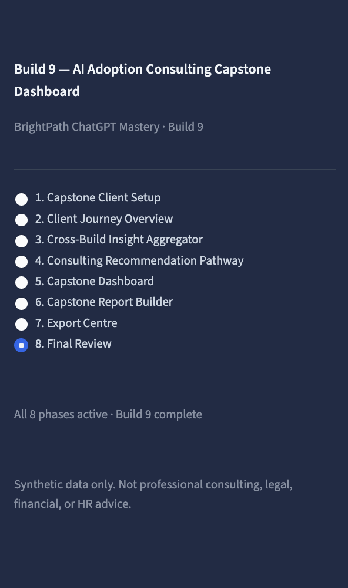

---

### Page-by-Page Walkthrough

<table>
<tr>
<td width="50%">

**1 — Capstone Client Setup**

Synthetic client table showing three organisations, 21 cross-build journey stages, and portfolio-level indicators. Entry point for the consulting session.

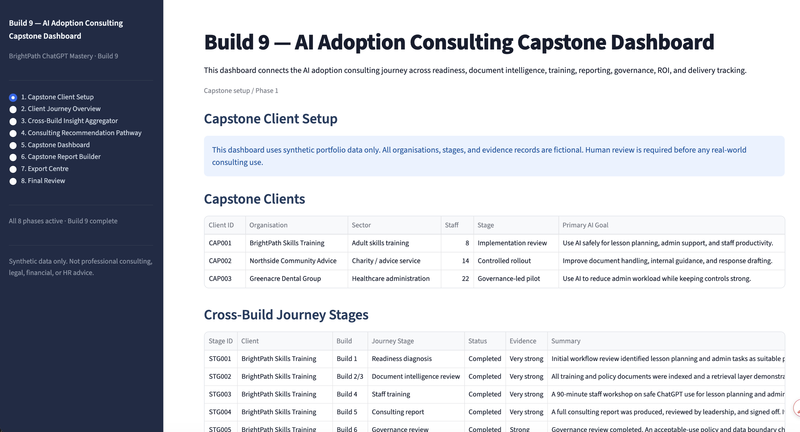

</td>
<td width="50%">

**2 — Client Journey Overview**

Journey health classification engine. Scores each client across all eight build areas and produces a prioritised review table: Strong, Healthy, Developing, Needs Review, or Blocked.

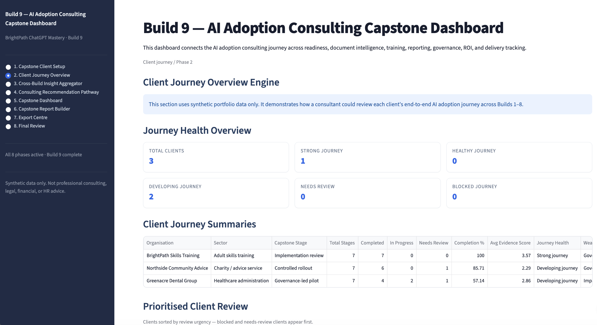

</td>
</tr>
<tr>
<td width="50%">

**3 — Cross-Build Insight Aggregator**

Build-area evidence health scores and a client-build status matrix. Surfaces which areas have strong evidence and which need further work before a commercial recommendation.

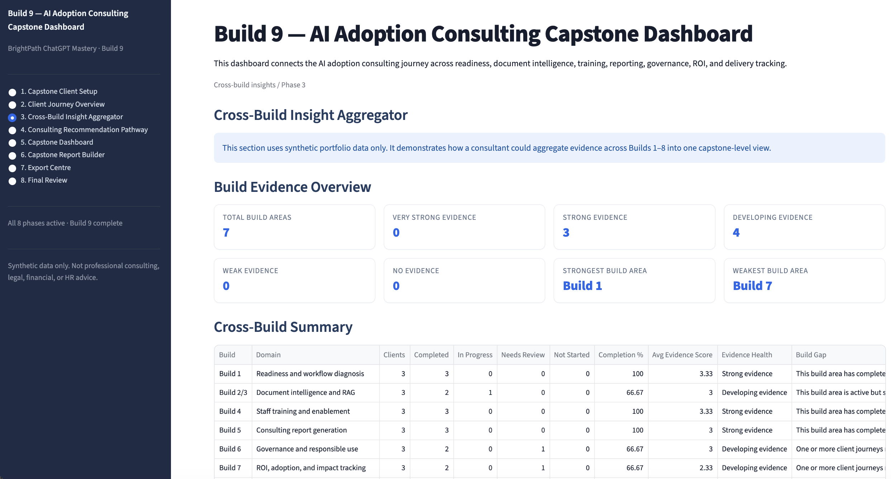

</td>
<td width="50%">

**4 — Consulting Recommendation Pathway**

Capstone readiness classification per client and a deterministic commercial next step: discovery, pilot, phased rollout, or governed scale. The output of the diagnostic phase.

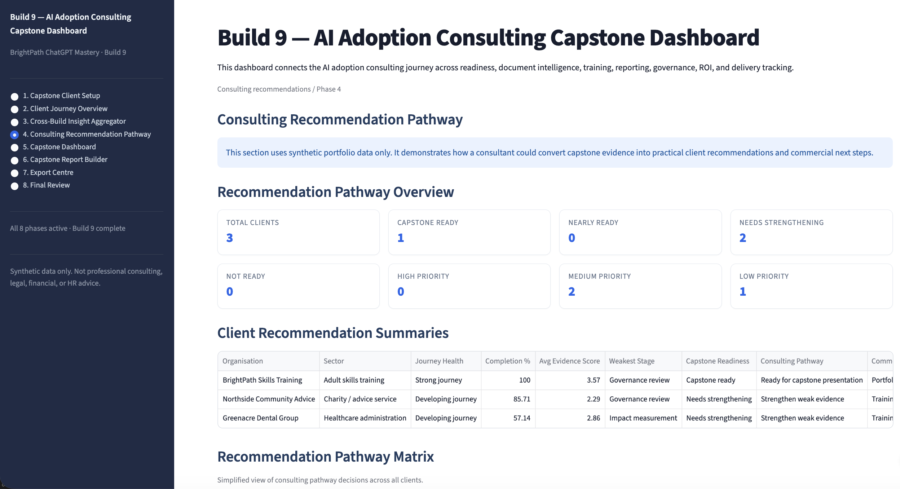

</td>
</tr>
<tr>
<td width="50%">

**5 — Capstone Dashboard**

Unified executive view: Client Spotlight, cross-client summary tables, and portfolio-level indicators. Designed to be the opening screen for a client-facing presentation.

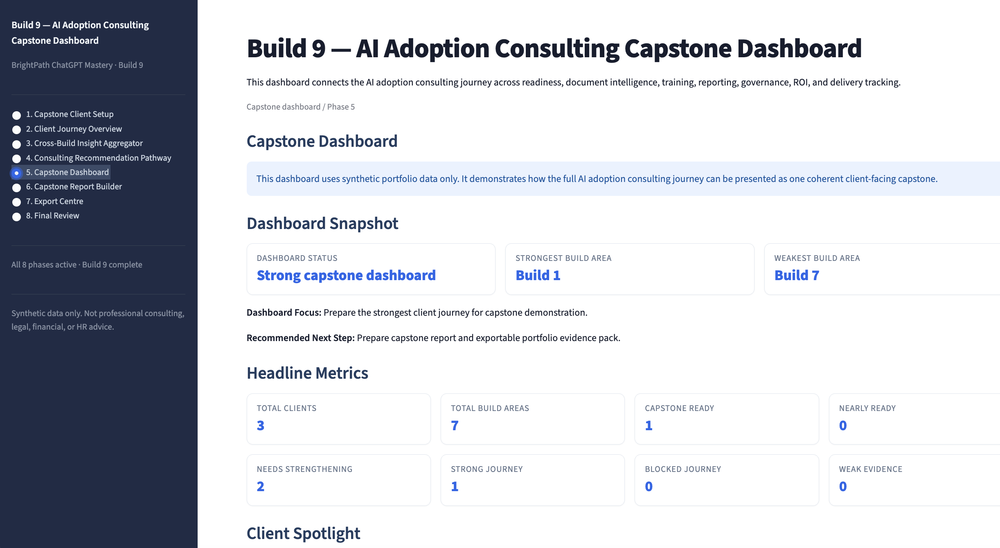

</td>
<td width="50%">

**6 — Capstone Report Builder**

Generates a full structured consulting report in Markdown — scoped to a single client or the entire portfolio. Sections follow standard consulting report structure: context, findings, recommendations, next steps.

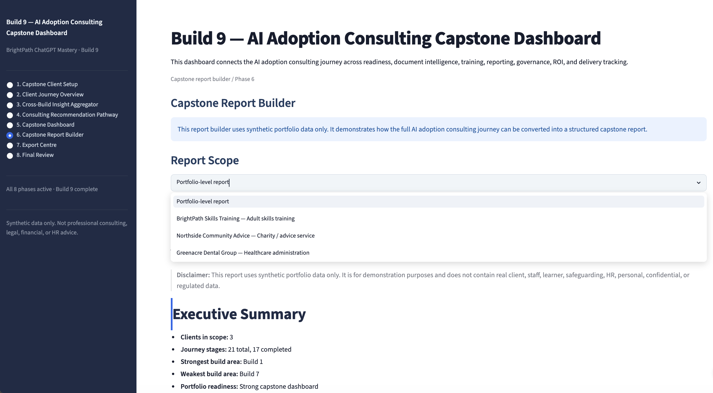

</td>
</tr>
<tr>
<td width="50%">

**7 — Export Centre**

One-click downloads for all five export formats. Markdown report, flat CSV evidence table, structured JSON pack, formatted PDF leave-behind, and PNG readiness chart for slides.

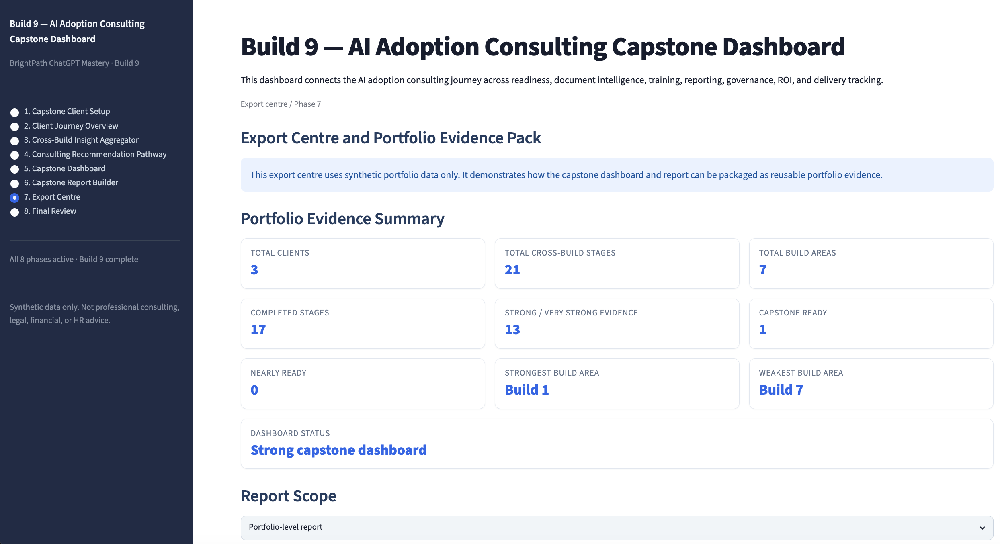

</td>
<td width="50%">

**8 — Final Review and Commercial Positioning**

Completion status across all eight phases, limitations statement, responsible use notice, and commercial positioning guidance. Closes the consulting session cleanly.

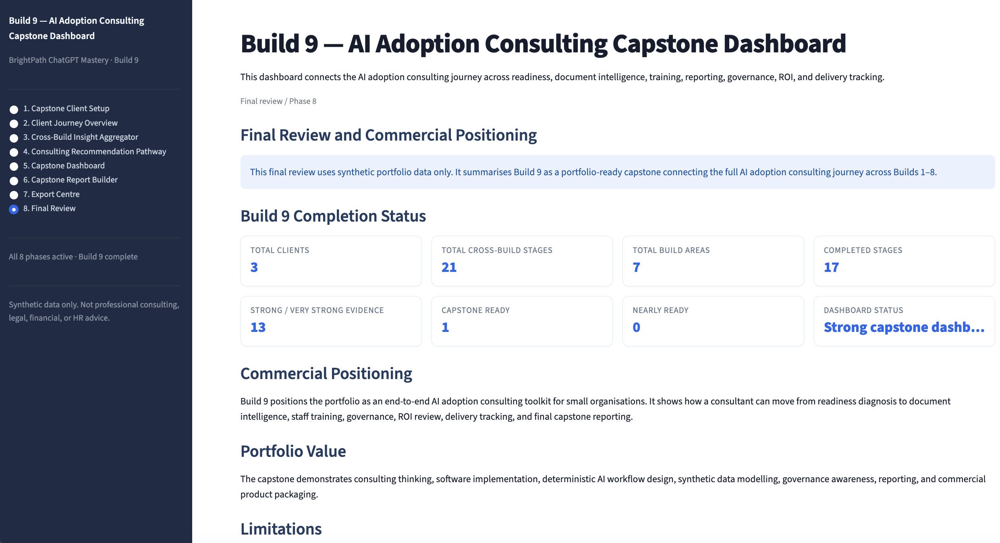

</td>
</tr>
</table>

---

### Export Outputs

<table>
<tr>
<td width="50%">

**CSV and JSON Evidence Pack**

Flat CSV for stakeholder review in a spreadsheet. Structured JSON for integration or record-keeping. Both export the full cross-build evidence table.

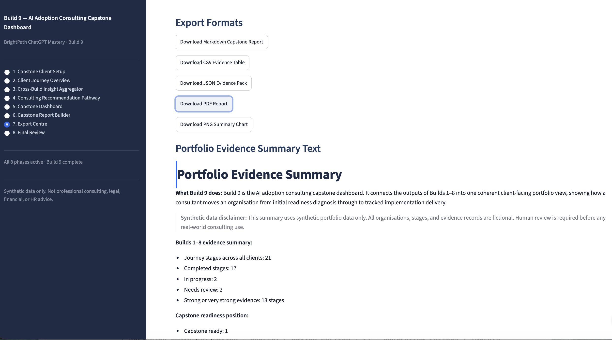

</td>
<td width="50%">

**PDF Consulting Report**

Formatted PDF report ready to email as a client leave-behind. Generated from the same Markdown source as the in-app report — no additional formatting step required.

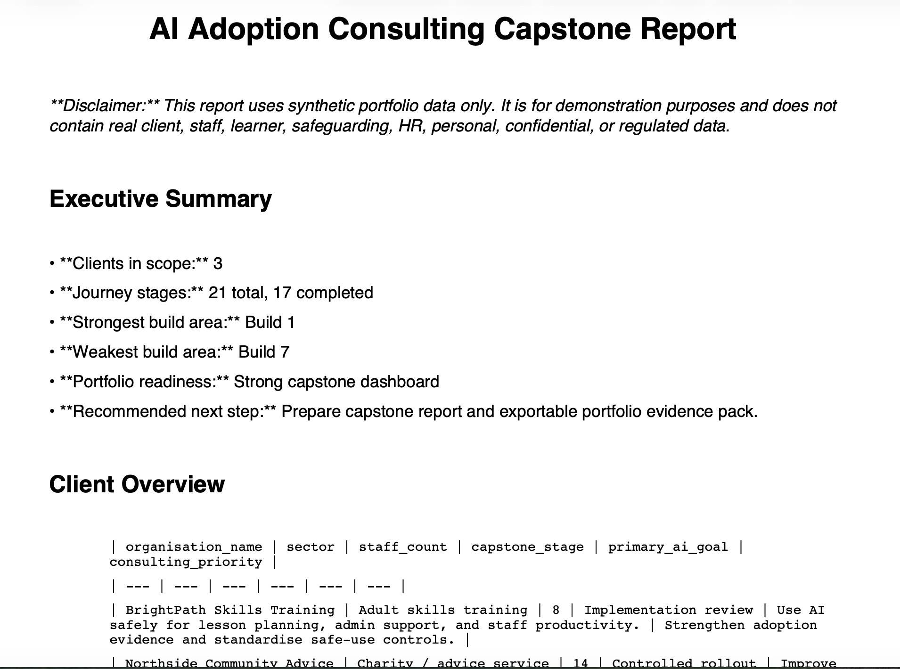

</td>
</tr>
</table>

---

## Export Formats

The Export Centre (page 7) produces five download formats from the same synthetic data source:

| Format | Content | Use Case |
|---|---|---|
| Markdown `.md` | Full capstone report, portfolio or client scope | Paste into a proposal, client document, or portfolio |
| CSV `.csv` | Flat evidence table, one row per client/build stage | Review in a spreadsheet, share with stakeholders |
| JSON `.json` | Structured evidence pack with all capstone data | Structured record or future live integration |
| PDF `.pdf` | Formatted consulting report | Client leave-behind after a discovery meeting |
| PNG `.png` | Capstone readiness bar chart | Slide deck, presentation, or LinkedIn post |

All exports are generated from synthetic demonstration data.

---

## Demo Flow

Recommended order for an 8–12 minute business audience:

1. **Capstone Client Setup** — introduce the three synthetic clients and 21 journey stages
2. **Client Journey Overview** — show journey health scoring and prioritised client review
3. **Cross-Build Insight Aggregator** — show build-area evidence health and the status matrix
4. **Consulting Recommendation Pathway** — show readiness classification and commercial next step
5. **Capstone Dashboard** — present the unified executive view and Client Spotlight
6. **Capstone Report Builder** — generate a portfolio-level or client-scoped report
7. **Export Centre** — download Markdown, CSV, JSON, PDF, and PNG
8. **Final Review** — close with completion status, limitations, and commercial positioning

See `portfolio_notes/build_9_demo_walkthrough.md` for the full presenter script, page-by-page talking points, and audience adaptation guidance.

---

## Commercial Positioning

Build 9 is suited for:

- **Portfolio demonstration** — walk a prospect, recruiter, or evaluator through a complete AI adoption consulting methodology in one session
- **Business development** — use the PDF report and PNG chart as a leave-behind after a discovery conversation
- **Methodology proof** — demonstrate a structured, repeatable, evidence-backed approach to AI adoption consulting across six UK sectors: training providers, universities, charities, NHS teams, housing associations, and professional services
- **Future productisation** — the methodology, logic, and export structure are ready to accept real client data and live integrations without redesign

This is not a production system. See `portfolio_notes/build_9_commercial_case_study.md` for the full commercial case study and future productisation path.

---

## Technical Architecture

```
app.py                               ← Streamlit presentation layer only
│
├── data/
│   └── synthetic_capstone_data.py   ← All synthetic clients, stages, indicators
│
├── logic/
│   ├── capstone_overview.py         ← Phase 1 summary and validation
│   ├── client_journey.py            ← Journey health engine
│   ├── cross_build_insights.py      ← Build-area evidence aggregation
│   ├── recommendation_pathway.py    ← Capstone readiness and commercial next step
│   ├── capstone_dashboard.py        ← Dashboard context assembly
│   ├── capstone_report.py           ← Markdown report builder
│   └── export_centre.py             ← All five export format generators
│
└── tests/                           ← 172 tests, all passing
    ├── test_synthetic_capstone_data.py
    ├── test_capstone_overview.py
    ├── test_client_journey.py
    ├── test_cross_build_insights.py
    ├── test_recommendation_pathway.py
    ├── test_capstone_dashboard.py
    ├── test_capstone_report.py
    └── test_export_centre.py
```

**Design principles:**

- All logic lives in pure functions in `logic/` — no side effects, fully testable in isolation
- `app.py` handles data loading and rendering only — no business logic
- All data flows from `data/synthetic_capstone_data.py` — one source of truth
- No shared mutable state between Streamlit pages
- British English throughout — consulting vocabulary, labels, and report text

---

## How to Run

```bash
cd 10-builds/ai_adoption_consulting_capstone
pip install -r requirements.txt
streamlit run app.py
```

Opens at **http://localhost:8501**. Start with **1. Capstone Client Setup** in the sidebar and follow the navigation through all eight pages.

---

## How to Run Tests

```bash
pytest
```

Expected output: **172 passed**

```bash
# Run a specific test file
pytest tests/test_client_journey.py
pytest tests/test_export_centre.py
```

---

## Synthetic Data and Safety

All data in this build is synthetic:

- **Three fictional client organisations:** BrightPath Digital Services, Northside Housing Association, Greenacre Professional Services
- **21 cross-build journey stages** designed to produce a range of Strong, Healthy, Developing, and Needs Review outcomes
- **Three capstone portfolio indicators** summarising overall adoption position

No real client data, personal data, learner records, safeguarding data, HR data, or regulated information is used anywhere in this build.

No external AI APIs are called. There are no calls to OpenAI, Claude, LangChain, LlamaIndex, or any language model. All outputs are deterministic Python logic.

---

## Limitations

| Limitation | Detail |
|---|---|
| Synthetic data only | Fictional clients and fictional evidence records — a demonstration of the methodology, not real consulting outcomes |
| No authentication | No user login — not suitable for storing real client data |
| No database | All data is in-process; nothing persists between sessions |
| No production deployment | Local Streamlit app only — not a cloud-hosted service |
| No live integrations | Builds 1–8 are not connected in real time; evidence flows through synthetic data |
| Human review required | Any real-world use of this methodology requires human judgement before delivery to a client |

---

## Future Improvements

The methodology, logic, report structure, and export formats are production-ready. What a live version would add:

1. Real client data input — form or file upload in place of the synthetic data module
2. Authentication — per-consultant login for private client portfolios
3. Persistent database — client data, journey stages, and evidence stored across sessions
4. Multi-tenant architecture — one instance per consulting firm
5. Cloud deployment — hosted access without a local install
6. Live integrations — evidence flowing directly from Builds 1–8 into the capstone layer

---

## Project Structure

```
ai_adoption_consulting_capstone/
├── app.py
├── requirements.txt
├── pytest.ini
├── README.md
├── .streamlit/
│   └── config.toml
├── data/
│   └── synthetic_capstone_data.py
├── logic/
│   ├── capstone_overview.py
│   ├── client_journey.py
│   ├── cross_build_insights.py
│   ├── recommendation_pathway.py
│   ├── capstone_dashboard.py
│   ├── capstone_report.py
│   └── export_centre.py
├── tests/
│   ├── test_synthetic_capstone_data.py
│   ├── test_capstone_overview.py
│   ├── test_client_journey.py
│   ├── test_cross_build_insights.py
│   ├── test_recommendation_pathway.py
│   ├── test_capstone_dashboard.py
│   ├── test_capstone_report.py
│   └── test_export_centre.py
├── assets/
│   └── screenshots/
└── portfolio_notes/
    ├── README.md
    ├── build_9_demo_walkthrough.md
    ├── build_9_commercial_case_study.md
    ├── build_9_commercial_positioning.md
    └── build_9_completion_review.md
```

---

## Portfolio Status

| Phase | Title | Status |
|---|---|---|
| 1 | Scaffold and Synthetic Capstone Client Data | Complete |
| 2 | Client Journey Overview Engine | Complete |
| 3 | Cross-Build Insight Aggregator | Complete |
| 4 | Consulting Recommendation Pathway | Complete |
| 5 | Capstone Dashboard UI | Complete |
| 6 | Capstone Report Builder | Complete |
| 7 | Export Centre and Portfolio Evidence Pack | Complete |
| 8 | Final Sweep and Commercial Positioning | Complete |

**All 8 phases complete. 172 tests passing. Ready for portfolio presentation.**

---

*Build 9 — AI Adoption Consulting Capstone Dashboard · Rashid AI Consult*  
*Synthetic data only. Not professional consulting, legal, financial, or HR advice.*
