# Build 10 — Production AI Document Intelligence & Governance Agent

> **Status:** Complete — 9 build phases · 386 tests · 10-page Streamlit app.
> **Type:** Streamlit application — semantic RAG + governance review + consulting UX.
> **Repository:** `rashid-ai-consult-portfolio` (public portfolio).
> **Preceded by:** Build 3 (semantic RAG prototype) in this portfolio.

---

## 1. What It Does

Build 10 is the flagship document intelligence build in this portfolio. It allows an organisation to load a set of policy and guidance documents, ask questions in natural language, receive grounded answers with source citations, see a structured governance risk review, and generate a downloadable document intelligence report.

The application uses sentence-transformer embeddings and a FAISS vector index for semantic retrieval — meaning queries are matched by meaning, not just by keyword overlap. This allows questions like "Can staff put learner names into ChatGPT?" to retrieve the relevant policy section even when the exact phrase does not appear in the document.

---

## 2. Why It Exists

Build 3 is a semantic RAG prototype — useful for demonstrating the vector retrieval pipeline phase by phase, but oriented as a teaching tool rather than a consulting product. A separate TF-IDF keyword baseline was developed as a stepping stone, establishing the explainable retrieval foundation before moving to dense embeddings.

Build 10 combines the semantic retrieval quality of Build 3 with a governance review capability, a structured report builder, and a consulting-grade user experience. It is designed as the tool you show a client to open a conversation about what an AI document intelligence system looks like in practice.

---

## 3. How It Differs from a TF-IDF Approach

| Dimension | TF-IDF baseline | Build 10 (this build) |
|---|---|---|
| Retrieval method | TF-IDF + cosine similarity | sentence-transformers + FAISS |
| Semantic range | Keyword frequency only | Synonym and paraphrase handling |
| Governance review | None | Yes — rule-based risk flags with recommended actions |
| Report builder | Markdown/CSV/JSON | Markdown with human review checklist |
| Documents | 6 synthetic docs | 8 synthetic docs |
| Portfolio status | Private development baseline | Flagship (this portfolio) |

---

## 4. How It Relates to Build 3

Build 3 (`semantic-rag-policy-assistant`) teaches the semantic RAG pipeline phase by phase — eight phases, 429 tests. Build 10 takes the same core technical approach (sentence-transformers + FAISS) and packages it as a complete consulting product with governance review, a structured report, and an evaluation dashboard.

| Aspect | Build 3 | Build 10 |
|---|---|---|
| Primary goal | Teach the pipeline | Demonstrate the consulting product |
| UX orientation | Educational phase explorer | Client-facing product |
| Governance page | None | Yes |
| Report format | 10-section Markdown answer | Full consulting report |

---

## 5. Features

- Semantic document retrieval (sentence-transformers + FAISS)
- Ten-page Streamlit application
- Grounded Q&A with source citations and confidence labels
- Governance and risk review with UK-aware safety notes
- Structured report builder with Markdown export
- Retrieval evaluation dashboard
- Manual evaluation form
- Eight rich synthetic policy documents
- Full pytest test suite
- No external API required by default
- Runs entirely locally

---

## 6. Architecture

```
Documents → Clean Text → Chunks → Embeddings (384-dim) → FAISS Index
                                                              ↓
Query → Query Embedding → FAISS Search → Ranked Chunks → Grounded Answer + Citations
                                              ↓
                                      Governance Checks → Risk Flags
                                              ↓
                                       Report Builder → Markdown Report
```

Stack: Python 3.11+ · Streamlit · sentence-transformers · FAISS · pandas · numpy · scikit-learn · pytest

---

## 7. Folder Structure

```
production_ai_document_intelligence_governance_agent/
├── app.py
├── README.md
├── requirements.txt
├── pytest.ini
├── .env.example
├── data/
│   ├── README.md
│   └── sample_documents/          (8 synthetic .md files)
├── logic/
│   ├── __init__.py
│   ├── document_loader.py
│   ├── text_cleaning.py
│   ├── chunking.py
│   ├── embeddings.py
│   ├── vector_index.py
│   ├── retrieval.py
│   ├── answer_generation.py
│   ├── governance_checks.py
│   ├── report_builder.py
│   ├── evaluation.py
│   └── ui_components.py
├── tests/
│   ├── test_document_loader.py
│   ├── test_text_cleaning.py
│   ├── test_chunking.py
│   ├── test_embeddings.py
│   ├── test_retrieval.py
│   ├── test_answer_generation.py
│   ├── test_governance_checks.py
│   ├── test_report_builder.py
│   └── test_evaluation.py
├── screenshots/
│   └── README.md
└── portfolio_notes/
    ├── build-summary.md
    ├── architecture-notes.md
    ├── limitations.md
    ├── client-demo-script.md
    └── reviewer-quick-read.md
```

---

## 8. Setup Instructions

**Requirements:** Python 3.10 or later.

```bash
cd builds/production_ai_document_intelligence_governance_agent
python -m venv .venv
source .venv/bin/activate      # macOS / Linux
.venv\Scripts\activate         # Windows
pip install -r requirements.txt
```

On first run, the Embedding Index page downloads the `sentence-transformers/all-MiniLM-L6-v2` model (~90MB). Internet access is required on first run only.

---

## 9. How to Run

```bash
streamlit run app.py
```

Opens at `http://localhost:8510`. Start with the Home page and navigate in order.

---

## 10. How to Run Tests

```bash
pytest
```

Run from the `production_ai_document_intelligence_governance_agent/` directory.

For a plain-English walkthrough of how to run, understand, and demo the app, see [portfolio_notes/how-to-run-and-demo.md](portfolio_notes/how-to-run-and-demo.md).

---

## 11. Sample Documents

Eight synthetic Markdown policy documents for BrightPath Skills Training (fictional organisation):

| Document | Type |
|---|---|
| AI Acceptable Use Policy | Policy |
| Staff ChatGPT Guidance | Guidance |
| Lesson Planning Workflow | Workflow guide |
| Monthly Reporting Process | Process guide |
| Safeguarding Boundary Note | Safeguarding note |
| Data Protection Reminder | Data protection |
| Human Review Checklist | Checklist |
| AI Pilot Evaluation Notes | Evaluation |

All documents are synthetic. All contain "Synthetic document — for demonstration purposes only."

---

## 12. Screenshots

### Home
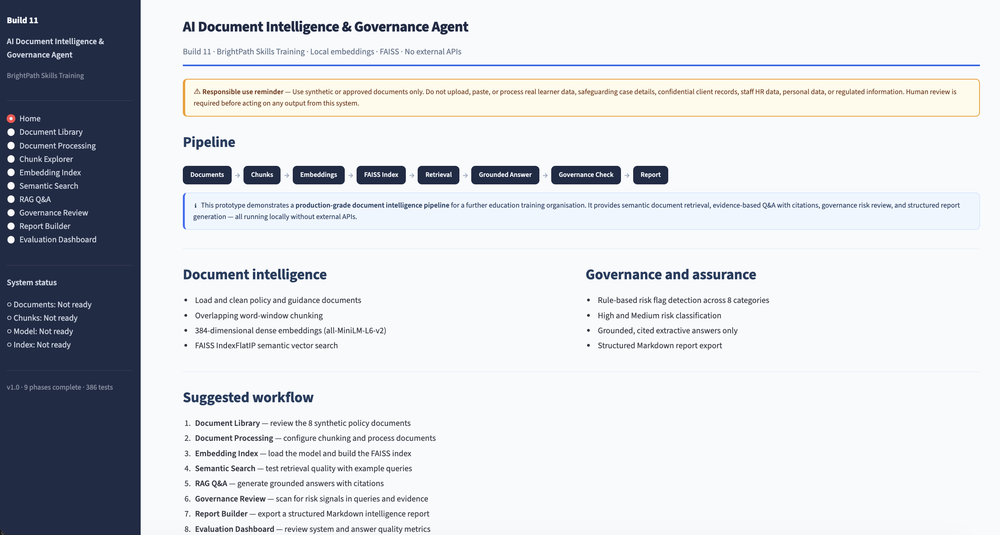

### Document Library
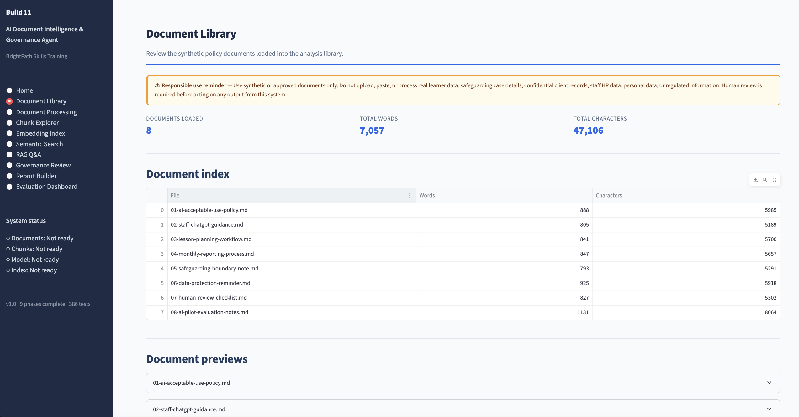

### Document Processing
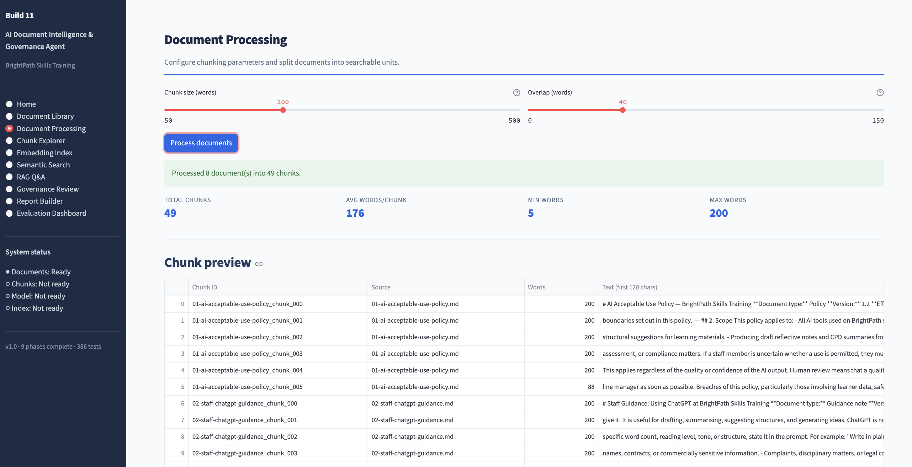

### Chunk Explorer
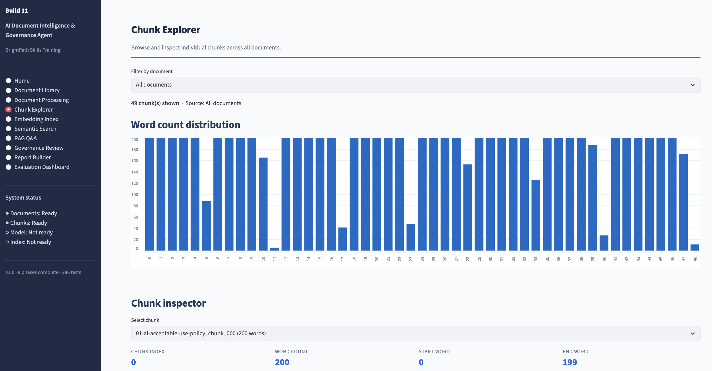

### Embedding Index
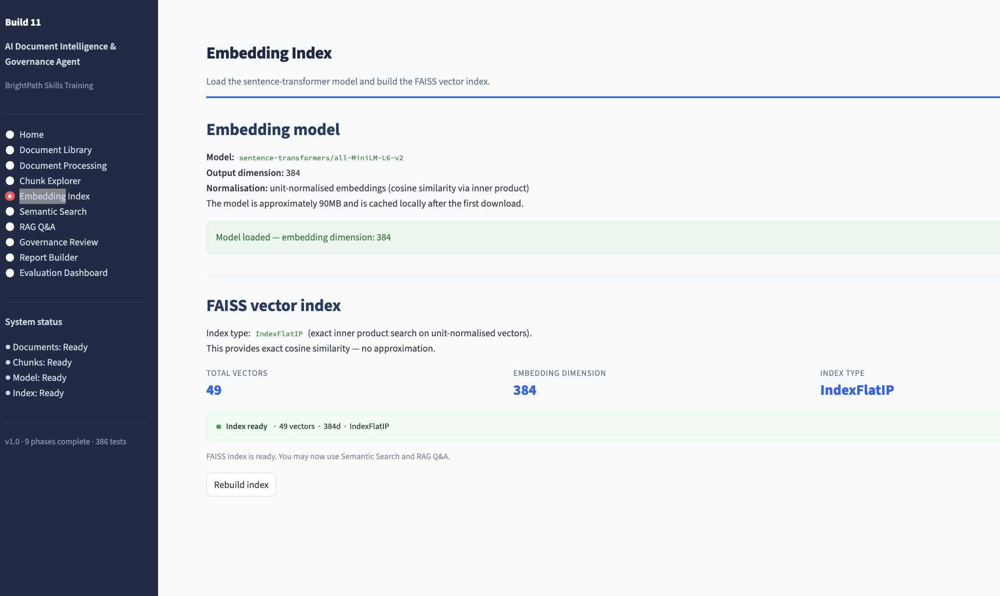

### Semantic Search
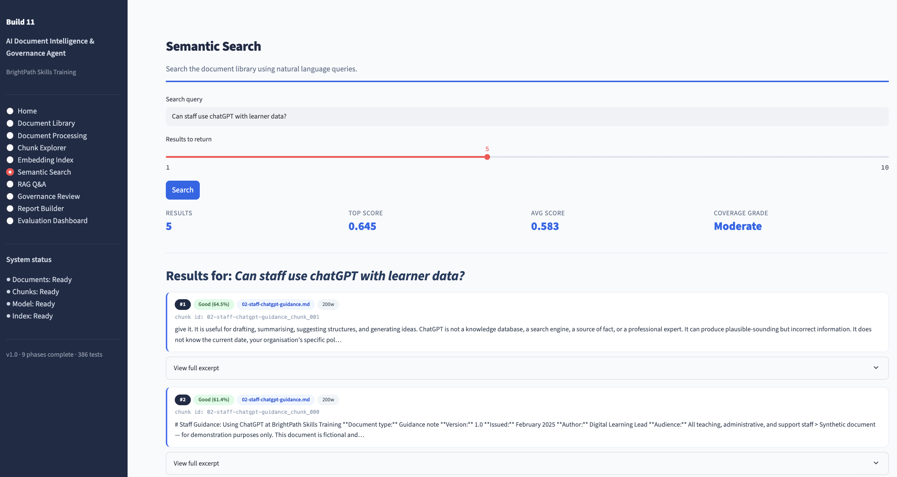

### RAG Q&A
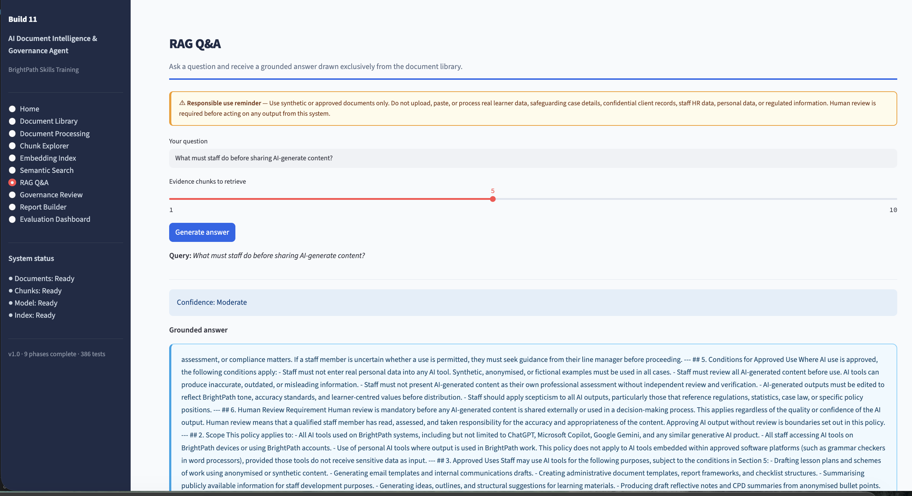

### Governance Review
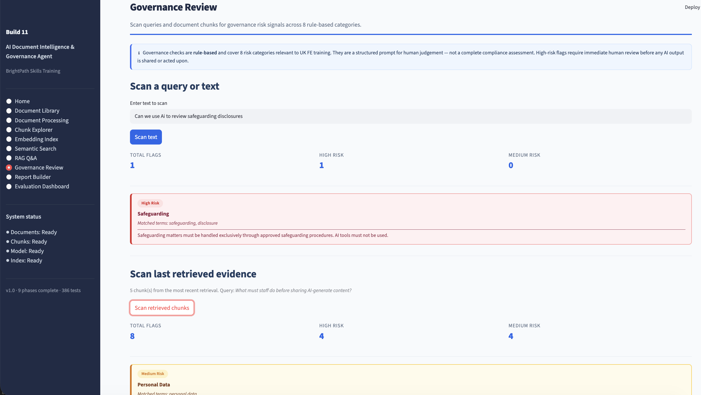

### Report Builder
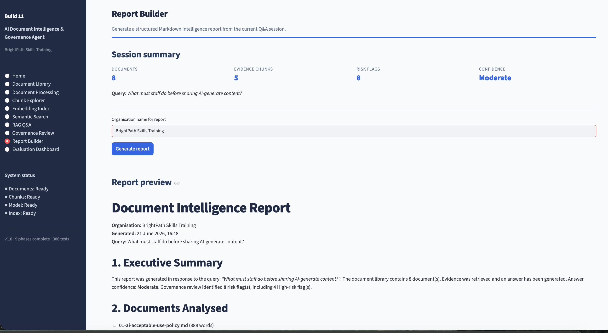

### Evaluation Dashboard
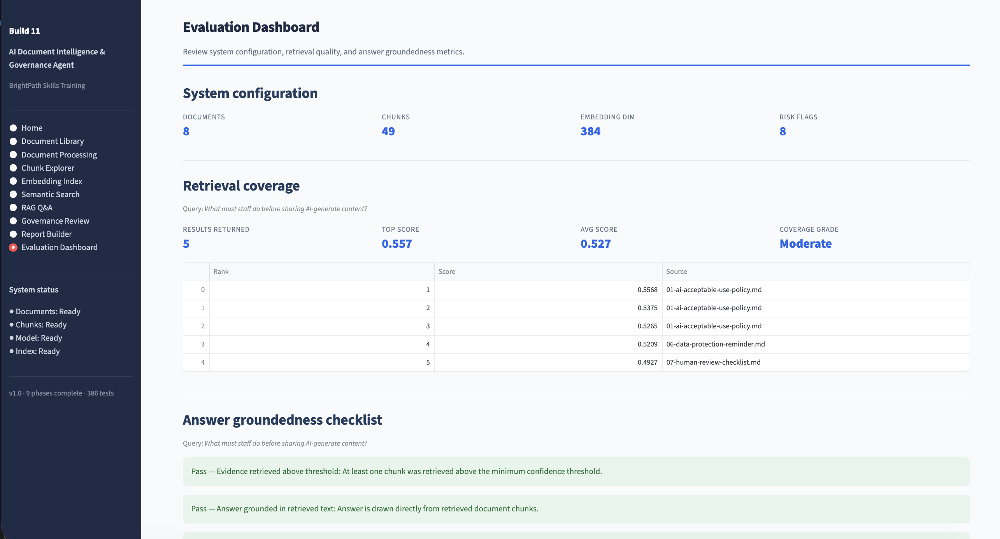

### Test Results
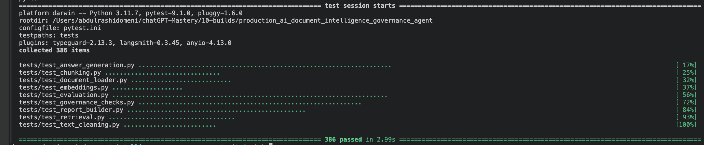

---

## 13. Governance and Safety

- All documents are synthetic and fictional. No real personal data is used.
- Every page includes a responsible-use notice.
- No external API calls are made by default. All processing runs locally.
- Human review is required before acting on any output from this tool.
- This tool does not provide legal, safeguarding, HR, compliance, medical, financial, or professional advice.
- Governance checks are rule-based. They are not a complete or infallible risk assessment.

---

## 14. Limitations

| Limitation | Detail |
|---|---|
| Synthetic documents only | Fictional content — demonstrates methodology, not real organisational knowledge |
| No external LLM | Answers are grounded extracts, not fluent prose |
| In-memory index | FAISS index rebuilt each session |
| Rule-based governance | Does not cover every risk category |
| No authentication | Not suitable for real sensitive data without access controls |
| .md and .txt upload only | PDF and DOCX support is documented future work |

---

## 15. Future Improvements

**Further improvements to the Streamlit prototype:**

- PDF and DOCX document support
- LLM-assisted prose answers (Claude API or OpenAI — optional, controlled by .env)
- Persistent FAISS index (save/load between sessions)
- Section-aware chunking
- Retrieval evaluation with configurable test questions and hit-rate

**Future full-stack version:**

| Layer | Technology |
|---|---|
| Frontend | Next.js |
| Backend | FastAPI |
| Storage | PostgreSQL |
| Vector database | Chroma or Pinecone |
| Generation | Claude API or OpenAI GPT-4 |
| Authentication | Per-user login, role-based access |
| Deployment | AWS / Azure / GCP or Vercel + Railway |

---

## 16. Portfolio Positioning

Build 10 demonstrates:

- Semantic retrieval using neural embeddings — not just keyword matching
- Governance integration — AI document systems need responsible-use controls
- End-to-end product thinking — from document loading to a downloadable report
- Production-style architecture — modular logic, full test suite, clean separation of concerns
- Client communication — demo script, build summary, commercial positioning in portfolio notes

**This is not a production enterprise system.** It is a production-style local prototype built to demonstrate architecture, methodology, and responsible AI practice to clients, employers, and collaborators.

---

*Build 10 · Production AI Document Intelligence & Governance Agent · Rashid AI Consult*
*Synthetic data only. Not professional consulting, legal, financial, safeguarding, or HR advice.*
