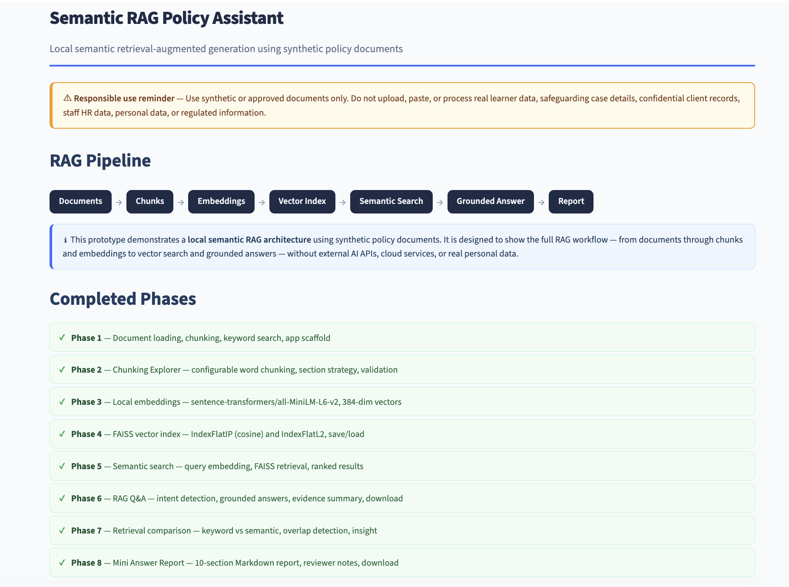
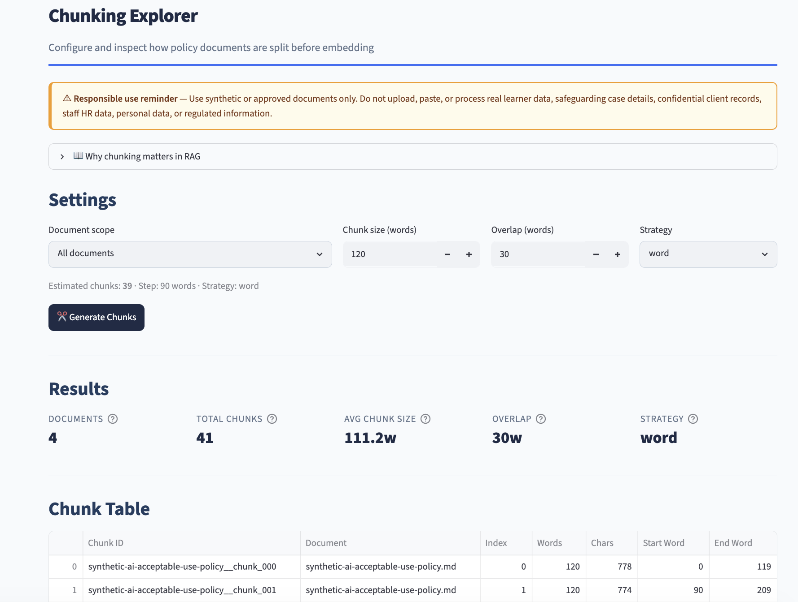
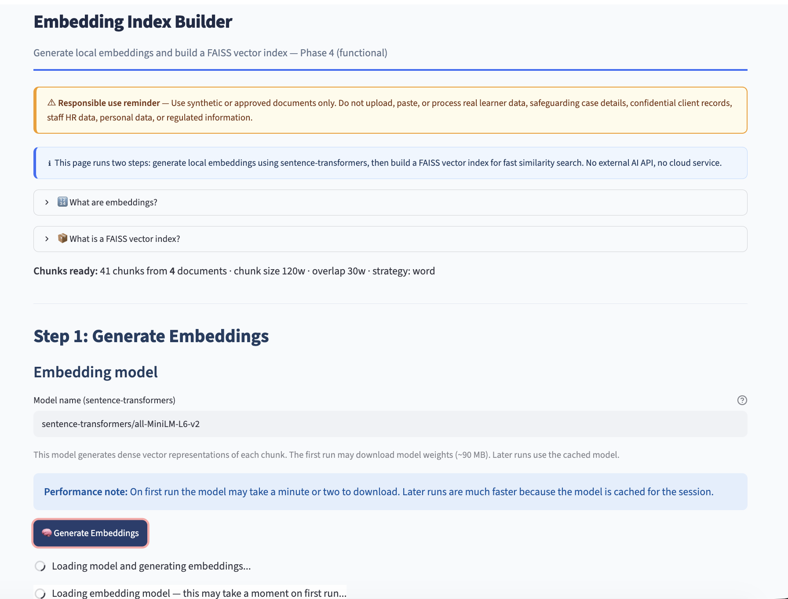
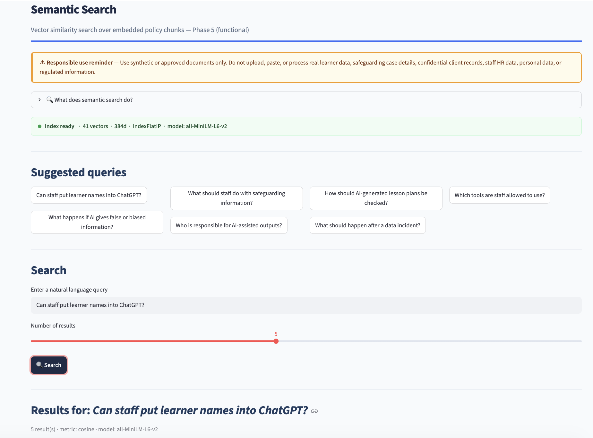
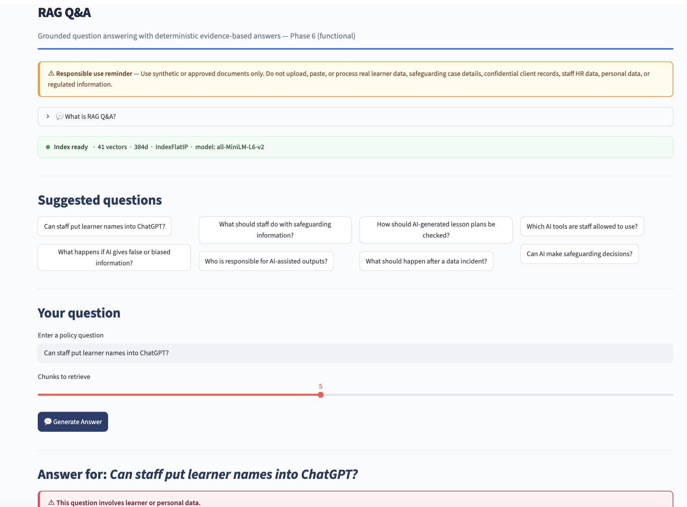
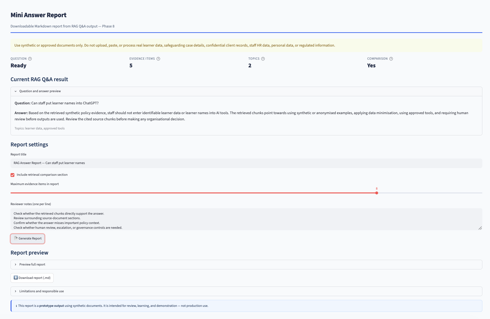

# Semantic RAG Policy Assistant

**A locally-run, production-style RAG prototype using synthetic policy documents.**

Build 3 of the BrightPath ChatGPT Mastery Project.
Eight phases. 429 tests. Zero external AI API calls.

---

## One-Line Summary

A working Streamlit prototype that chunks synthetic policy documents, builds a local FAISS vector index, performs semantic search, generates grounded evidence-based answers, compares keyword against semantic retrieval, and produces a downloadable Markdown report — all locally, without external AI APIs.

---

## Problem

Organisations considering semantic RAG for their policy documents face a practical gap before production commitment:

- They need to understand the full RAG pipeline before choosing an architecture
- They need a safe way to prototype chunking, embedding, and retrieval on controlled documents
- They need to see what grounded answers look like — and where the evidence comes from
- They need to understand why semantic search improves over keyword matching
- They need auditable, explainable outputs that a human reviewer can assess
- They need to see where the safe prototype boundaries are before scaling up

This build demonstrates the complete RAG pipeline — documents through chunks, embeddings, vector search, grounded Q&A, retrieval comparison, and Markdown reporting — in a locally-run, testable, responsibly-bounded prototype.

---

## Target Users

| User | Why they use this |
|---|---|
| AI consultants (primary: Rashid) | Demonstrating full semantic RAG to clients before production commitment |
| Developers | Learning local RAG architecture phase by phase |
| Governance leads and managers | Understanding what semantic RAG does before approving investment |
| Clients evaluating RAG approaches | Seeing a transparent, locally-run starting point before vendor commitment |

---

## Why This Matters

Before any organisation deploys semantic RAG on their policy documents they need to:

1. Chunk documents into retrievable units
2. Generate local embeddings that capture document meaning
3. Build a vector index for fast semantic similarity search
4. Retrieve relevant chunks for a query using cosine similarity
5. Combine retrieved evidence into a grounded, source-cited answer
6. Compare semantic retrieval against keyword retrieval to validate the improvement
7. Generate a reviewable, downloadable report of the full pipeline output

This build demonstrates all seven steps in a safe, locally-run, phase-by-phase prototype — with responsible-use controls built in at every layer.

---

## Core Features

| Feature | Phase | Status |
|---|---|---|
| Load and preview synthetic policy documents | 1 | Live |
| Configurable word-based chunking with overlap | 1–2 | Live |
| Keyword search over document chunks | 1 | Live |
| Chunking Explorer with cards and table view | 2 | Live |
| Local embedding generation (sentence-transformers) | 3 | Live |
| FAISS vector index (IndexFlatIP / IndexFlatL2) | 4 | Live |
| Semantic search with cosine similarity | 5 | Live |
| Deterministic grounded RAG Q&A | 6 | Live |
| Keyword vs semantic retrieval comparison | 7 | Live |
| Mini Answer Report (10-section Markdown download) | 8 | Live |

---

## App Pages

| Page | Status |
|---|---|
| Home | Fully functional — pipeline diagram, phase status, live metrics |
| Document Library | Fully functional — metadata table, preview |
| Chunking Explorer | Fully functional — configurable, cards and table view |
| Embedding Index Builder | Fully functional — embeddings + FAISS index |
| Semantic Search | Fully functional — query embedding + FAISS retrieval |
| RAG Q&A | Fully functional — deterministic grounded answers + evidence + download |
| Retrieval Comparison | Fully functional — keyword vs semantic side-by-side + overlap + insight |
| Mini Answer Report | Fully functional — 10-section report + reviewer notes + download |

---

## Quick Demo Scenario

**Scenario:** A training provider wants to know whether staff can put learner names into ChatGPT.

1. **Chunking Explorer** — chunk the four synthetic policy documents at 120 words, 30 overlap
2. **Embedding Index Builder** — generate local embeddings, build FAISS cosine index
3. **Semantic Search** — query: _"Can staff put learner names into ChatGPT?"_ — see ranked chunks
4. **RAG Q&A** — same question — see grounded answer, evidence cards, caution note
5. **Retrieval Comparison** — see how keyword and semantic results compare for the same query
6. **Mini Answer Report** — generate and download the full Markdown report with all sections

Expected answer: Staff must not enter identifiable learner data or names into AI tools. Staff should use synthetic or anonymised examples, data-minimised prompts, and approved tools — with human review of all outputs.

---

## Responsible-Use Boundaries

> **Use synthetic or approved documents only. Do not upload, paste, or process real learner data, safeguarding case details, confidential client records, staff HR data, personal data, or regulated information.**

- All documents in this prototype are synthetic, fictional, and clearly labelled
- No external AI API calls — all processing runs locally
- Human review is required before acting on any output
- This tool does not provide legal, safeguarding, HR, compliance, medical, financial, or professional advice
- Production use would require governance, DPIA, security review, and responsible-owner approval

See [docs/safety-boundaries.md](docs/safety-boundaries.md) for the full safety statement.

---

## Technical Stack

| Component | Technology |
|---|---|
| UI framework | Streamlit |
| Data tables | Pandas |
| Language | Python 3.11 |
| State management | `st.session_state` |
| Document format | Markdown (.md) |
| Chunking | Word-based sliding window with configurable overlap |
| Keyword search | Token matching with stop-word filter |
| Embeddings | sentence-transformers/all-MiniLM-L6-v2 (local, no API) |
| Vector index | FAISS IndexFlatIP (cosine) / IndexFlatL2 |
| Semantic search | Cosine similarity via FAISS |
| RAG Q&A | Deterministic intent detection + template-based answer generation |
| Retrieval comparison | Keyword vs semantic side-by-side with overlap detection |
| Report generation | Markdown with 10 structured sections |
| Testing | pytest (429 tests) |
| External APIs | None |
| Database | None |
| Authentication | None |

---

## Safety Boundaries

- All documents are synthetic, anonymised, and fictional
- Do not enter real learner data, safeguarding case details, confidential client records, staff HR data, personal data, or regulated information
- No external AI API calls — all processing runs locally
- Human review of all evidence, answers, and reports is required before acting on any output
- This tool does not provide legal, safeguarding, HR, compliance, medical, financial, or professional advice

See [docs/safety-boundaries.md](docs/safety-boundaries.md) for the full safety statement.

---

## Folder Structure

```
semantic-rag-policy-assistant/
├── app.py                          # 8-page Streamlit app (Phase 8)
├── requirements.txt                # streamlit, pandas, numpy, sentence-transformers, faiss-cpu, pytest
├── pytest.ini                      # pythonpath = .
│
├── src/
│   ├── document_loader.py          # list, load, load_all, metadata
│   ├── chunker.py                  # validate, estimate, chunk_text, chunk_documents, summary
│   ├── keyword_search.py           # tokenise_query, keyword_search_chunks
│   ├── embedding_engine.py         # load_model, embed_chunks, embed_texts, summary
│   ├── vector_store.py             # build_faiss_index, create_vector_store, search, save/load
│   ├── semantic_search.py          # embed_query, semantic_search, format_results
│   ├── rag_engine.py               # detect_intent, generate_answer, generate_rag_response, markdown
│   ├── comparison.py               # compare_retrieval_methods, summarise, overlap, insight, markdown
│   ├── report_generator.py         # build_report_data, generate_markdown_answer_report
│   ├── ui_components.py            # inject_css, render_page_header, render_metric_card, etc.
│   └── sample_data.py              # DOCS_DIR, DEMO_QUERIES, PLANNED_PHASES
│
├── data/
│   └── synthetic_documents/        # Four synthetic policy Markdown files
│
├── assets/
│   └── screenshots/                # Portfolio screenshots (see docs/screenshots-checklist.md)
│
├── indexes/                        # Saved FAISS indexes (Phase 4+)
│
├── outputs/
│   └── reports/                    # Saved Markdown reports (Phase 8+)
│
├── docs/
│   ├── build-3-completion-review.md
│   ├── portfolio-case-study.md
│   ├── demo-script.md
│   ├── screenshots-checklist.md
│   ├── build-reflection.md
│   ├── build-notes.md
│   ├── architecture.md
│   ├── safety-boundaries.md
│   ├── deployment-notes.md
│   └── future-improvements.md
│
└── tests/
    ├── test_document_loader.py      # 20 tests
    ├── test_chunker.py              # 60 tests
    ├── test_keyword_search.py       # 21 tests (approx)
    ├── test_embedding_engine.py     # 51 tests
    ├── test_vector_store.py         # 35 tests
    ├── test_semantic_search.py      # 50 tests
    ├── test_rag_engine.py           # 66 tests
    ├── test_comparison.py           # 47 tests
    └── test_report_generator.py     # 55 tests
                                     # Total: 429 tests
```

---

## Synthetic Documents

Four synthetic Markdown policy documents in `data/synthetic_documents/`:

| Document | Topics |
|---|---|
| `synthetic-ai-acceptable-use-policy.md` | Approved use, learner data, safeguarding boundaries, human review, accountability, escalation |
| `synthetic-data-protection-guidance.md` | Data minimisation, anonymisation, approved tools, access control, retention, incident reporting |
| `synthetic-safeguarding-and-ai-boundaries.md` | Safeguarding/AI boundaries, escalation, decision-making limits, safe and unsafe prompts |
| `synthetic-staff-ai-training-notes.md` | Safe prompting, output checking, hallucination risk, bias, copyright, escalation |

All documents are fictional. All contain "Synthetic — for demonstration purposes only" in the header.

---

## Setup Instructions

**Requirements:** Python 3.10 or later.

```bash
# 1. Navigate to the project
cd 10-builds/semantic-rag-policy-assistant

# 2. Create and activate a virtual environment
python -m venv .venv
source .venv/bin/activate      # macOS / Linux
.venv\Scripts\activate         # Windows

# 3. Install dependencies
pip install -r requirements.txt
```

**Note:** On first run, the Embedding Index Builder will download the `sentence-transformers/all-MiniLM-L6-v2` model (~90 MB). This requires internet access on first load only.

---

## How to Run

```bash
streamlit run app.py
```

Opens at `http://localhost:8501` by default.

---

## Running Tests

```bash
pytest
```

Run from the `semantic-rag-policy-assistant/` directory. No API keys, model downloads, or external services required for tests. All tests use fake/mock data.

---

## Screenshots

The screenshots below show the main semantic RAG workflow using synthetic policy documents.

### Home and RAG Workflow Overview



The home page shows the full eight-phase RAG pipeline and completion status for each phase.

### Chunking Explorer



The Chunking Explorer lets you configure chunk size and overlap, and previews every chunk with word count and source range.

### Embedding and FAISS Index Builder



The Embedding Index Builder generates 384-dimensional vectors locally using sentence-transformers and builds a FAISS cosine similarity index — no external API calls.

### Semantic Search



Semantic search retrieves the most relevant policy chunks for the query "Can staff put learner names into ChatGPT?" ranked by cosine similarity.

### RAG Q&A



The RAG Q&A page generates a grounded, deterministic answer with a caution note for sensitive topics and evidence cards linking each claim to a source chunk.

### Mini Answer Report



The Mini Answer Report generates a 10-section Markdown document including the question, answer, evidence, retrieval comparison, caution notes, and responsible-use limitations.

---

Additional screenshots are stored in [assets/screenshots/](assets/screenshots/) and listed in [docs/screenshots-checklist.md](docs/screenshots-checklist.md).

---

## Completed Phases

| Phase | What was built | Status |
|---|---|---|
| 1 | Scaffold — document loading, chunking, keyword search, app scaffold, tests | Complete |
| 2 | Improved chunking — validation, summary, section strategy, Chunking Explorer | Complete |
| 3 | Local embeddings using sentence-transformers/all-MiniLM-L6-v2 | Complete |
| 4 | FAISS vector index (IndexFlatIP / IndexFlatL2), in-memory index, save/load | Complete |
| 5 | Semantic search — query embedding, FAISS retrieval, ranked results with source labels | Complete |
| 6 | RAG Q&A — deterministic grounded answers, intent detection, evidence summary, download | Complete |
| 7 | Retrieval comparison — keyword vs semantic, overlap, comparison insight, download | Complete |
| 8 | Mini Answer Report — 10-section Markdown report, reviewer notes, download | Complete |
| 9 | Completion review and portfolio documentation | Complete |

---

## Current Limitations

- Vector index is in-memory only — no persistent storage between sessions
- Chunking is word-based — no sentence or paragraph awareness
- RAG answers use deterministic templates — no LLM-generated prose
- No document upload — documents must be placed in `data/synthetic_documents/` manually
- No authentication — single-session, local use only
- No PDF export — reports are Markdown only

---

## Future Improvements

**Short-term:** PDF export, demo presets, persistent FAISS index, pipeline status sidebar.

**Medium-term:** document upload for synthetic/approved files, section-aware chunking, metadata filtering, retrieval evaluation metrics, persistent local indexes.

**Long-term:** LLM-assisted grounded answers with strict evidence controls, hybrid retrieval, secure deployment with authentication, audit logging, DPIA-compliant production architecture.

See [docs/future-improvements.md](docs/future-improvements.md) for the full list.

---

## Relationship to Build 1 and Build 2

**Build 1 — AI Consulting Diagnostic Tool** demonstrated safe, structured AI readiness assessment using deterministic logic, keyword evidence extraction, and templated reporting — without AI model calls. It established the responsible-use framework this build inherits.

**Build 2 — Document Intelligence and RAG Demo** added deterministic document intelligence using keyword extraction, topic-based evidence retrieval, risk mapping, and templated answers. It demonstrated the full evidence-extraction pipeline and proved that useful policy analysis does not require LLM calls.

**Build 3 — Semantic RAG Policy Assistant** takes the next step: chunking documents, generating local embeddings, building a vector index, and performing semantic search — upgrading from deterministic keyword retrieval to neural similarity-based retrieval. The same synthetic documents and safety boundaries carry forward.

---

## Relationship to Layer 5: Document Intelligence Agent

Layer 5 of the ChatGPT Mastery curriculum covers:

- Document chunking strategies and their trade-offs
- The keyword-to-embedding progression
- Vector index construction and semantic retrieval
- RAG pipeline architecture and grounding principles
- Responsible AI boundaries for document intelligence

Build 3 demonstrates all of these as a working, testable, locally-run prototype.

---

## AI Consulting and Portfolio Positioning

Build 3 demonstrates that Rashid can:

- Design and implement a multi-phase RAG pipeline from scratch
- Build local semantic search without external AI API dependencies
- Implement responsible AI controls across the full pipeline
- Compare retrieval methods and explain the trade-offs to clients
- Create a testable, modular Streamlit prototype with 429 passing tests
- Turn document intelligence concepts into a portfolio-ready product demonstration

**This is not a production system.** It is a production-style prototype built to demonstrate architecture, methodology, and responsible AI practice to clients, employers, and collaborators.

---

*Build 3 · Semantic RAG Policy Assistant · BrightPath ChatGPT Mastery Project*
*All sample data and documents are synthetic. This tool provides indicative evidence only.*
